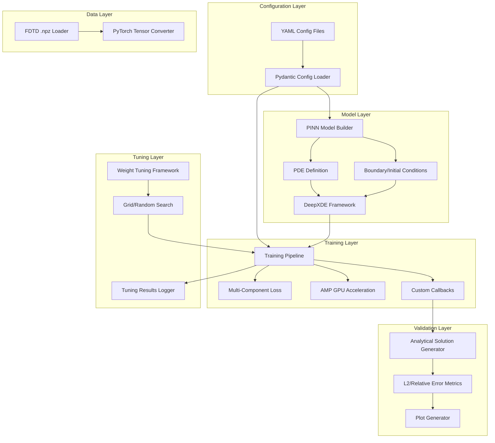
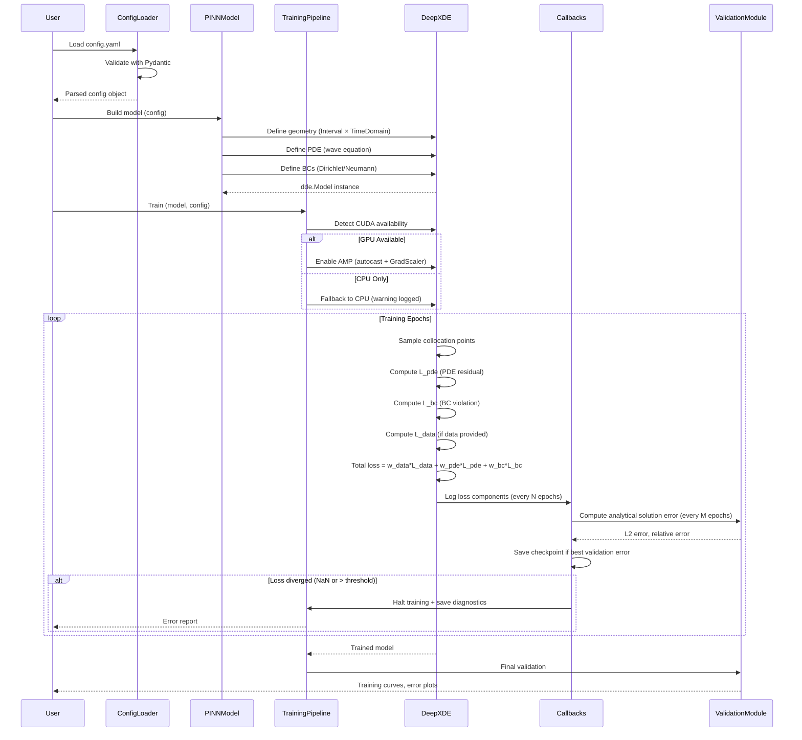
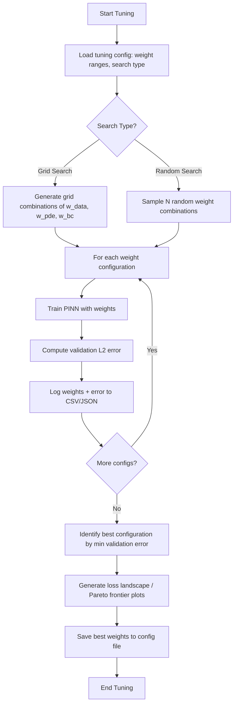

# Technical Design Document: PINN 1D Foundation

## Overview

This feature delivers a foundational Physics-Informed Neural Network (PINN) implementation for solving the 1D wave equation using DeepXDE. The primary purpose is to validate the PINN infrastructure, GPU-accelerated training pipeline, and loss function tuning framework before advancing to 2D elastic wave physics in subsequent phases.

**Purpose**: Physics simulation developers will use this implementation to verify DeepXDE framework integration, tune physics-informed loss functions, and establish reproducible training workflows. This serves as a learning phase—testing against analytical solutions rather than complex FDTD data—to build confidence in the PINN approach before tackling production 2D ultrasonic inspection simulations.

**Impact**: Establishes the `/pinn/` module structure, introduces DeepXDE + PyTorch + CUDA toolchain, and creates reusable utilities (data loading, visualization, config management) that will be extended for Phase 2 (2D PINN with FDTD integration).

### Goals
- Implement 1D wave equation PINN (∂²u/∂t² = c²∂²u/∂x²) using DeepXDE 1.15.0 with configurable boundary conditions
- Validate predictions against analytical solutions (standing/traveling waves) with <5% relative L2 error
- Establish GPU-accelerated training pipeline using PyTorch 2.4.0 with CUDA 12.4 and automatic mixed precision (AMP)
- Build automated loss weight tuning framework (grid/random search) for balancing w_data, w_pde, w_bc
- Create FDTD .npz data loading utilities for future 2D implementation
- Achieve 70% test coverage with comprehensive unit and integration tests

### Non-Goals
- 2D elastic wave physics or coupling of stress field components (T1, T3, Ux, Uy) — deferred to Phase 2
- Comparison with FDTD simulation data — Phase 1 uses only analytical solutions
- Production deployment or real-time inference optimization
- Advanced adaptive loss weighting methods (ReLoBRaLo, gradient-based) — manual tuning baseline sufficient for validation phase
- Crack geometry modeling or ultrasonic inspection workflows

## Architecture

### Architecture Pattern & Boundary Map

**Selected Pattern**: Modular Functional with DeepXDE Native Training

This hybrid approach combines DeepXDE's built-in training capabilities with modular utility components for extensibility. The architecture separates concerns into four primary layers:



**Architecture Integration**:
- **Selected pattern**: Modular functional design with clear layer boundaries (Configuration → Model → Training → Validation)
- **Domain/feature boundaries**:
  - **Configuration Layer**: Isolates experiment setup from implementation (YAML → Pydantic validation)
  - **Model Layer**: Encapsulates PDE physics and DeepXDE API (reusable for different wave equations)
  - **Training Layer**: Handles optimization and GPU management (extensible to custom training loops)
  - **Validation Layer**: Provides analytical comparison infrastructure (swappable for FDTD validation in Phase 2)
  - **Data Layer**: Abstracts .npz file format (prepared for Phase 2 integration)
  - **Tuning Layer**: Decouples hyperparameter search from training logic
- **Existing patterns preserved**:
  - Follows `/ref/` reference structure: separate utilities for sampling, data loading, signal processing
  - Maintains `snake_case.py` file naming and `PascalCase` class conventions from steering
  - Uses fixed seed (42) for reproducibility like existing `SpatioTemporalSampler`
- **New components rationale**:
  - **PINN Model Builder**: DeepXDE-specific abstraction not present in `/ref/` FDTD code
  - **AMP Wrapper**: GPU acceleration layer for future 2D models (FDTD uses CuPy, PINN uses PyTorch)
  - **Tuning Framework**: Systematic hyperparameter optimization (FDTD uses manual parameter sweeps)
- **Steering compliance**:
  - Aligns with "Physics Layer Separation" (PINN modeling in `/pinn/`, FDTD in `/ref/`)
  - Follows "GPU Memory Management" principles (explicit CUDA device control, minimize CPU↔GPU transfers)
  - Adheres to "Reproducibility" standards (fixed seeds, metadata logging)

### Technology Stack

| Layer | Choice / Version | Role in Feature | Notes |
|-------|------------------|-----------------|-------|
| ML Framework | DeepXDE 1.15.0 | PINN model definition, PDE residual computation, BC enforcement | Built on PyTorch backend; provides `dde.geometry.GeometryXTime`, `dde.data.TimePDE`, `dde.Model` APIs |
| Deep Learning Backend | PyTorch 2.4.0 | Neural network construction, automatic differentiation, GPU training | Required by DeepXDE; provides `torch.nn`, `torch.optim`, `torch.cuda.amp` |
| GPU Acceleration | CUDA 12.4 + CuPy 13.3.0 | GPU memory management, mixed precision training (AMP) | CuPy for potential future FDTD integration; CUDA for PyTorch backend |
| Numerical Computing | NumPy 1.x (<2.0) | Array operations, analytical solution computation | Steering constraint: `numpy = "<2.0"` for compatibility |
| Scientific Computing | SciPy | Latin Hypercube Sampling (LHS) for collocation points (future use) | Reuses existing `sampling_utils.py` patterns |
| Configuration | PyYAML + Pydantic 2.x | YAML config parsing with runtime validation | Type-safe experiment configurations |
| Visualization | Matplotlib 3.9.2 + Seaborn 0.13.2 | Training curves, solution comparisons, loss landscapes | Existing steering stack |
| Testing | pytest 9.x + pytest-cov | Unit/integration tests, coverage measurement | Steering standard |
| Code Quality | Ruff 0.14.9 | Linting and formatting | Steering standard |

**Rationale**: DeepXDE chosen over raw PyTorch for domain-specific PINN API (automatic PDE residual computation, built-in BC types). PyTorch AMP provides 2-3X GPU speedup with 3-line integration. Pydantic adds type safety to YAML configs. See `research.md` for trade-off analysis.

## System Flows

### Training Flow with Loss Monitoring



### Weight Tuning Flow



## Requirements Traceability

| Requirement | Summary | Components | Interfaces | Flows |
|-------------|---------|------------|------------|-------|
| 1.1-1.6 | 1D wave equation PINN model with DeepXDE | PINNModelBuilder, PDEDefinition, BoundaryConditions | Service | Training Flow |
| 2.1-2.5 | Boundary/initial conditions (Dirichlet, Neumann, periodic) | BoundaryConditions, DeepXDE IC/BC classes | Service | Training Flow |
| 3.1-3.6 | Physics-informed multi-component loss function | LossComputation, TrainingPipeline | Service | Training Flow |
| 4.1-4.6 | Analytical solution validation | AnalyticalSolutionGenerator, ErrorMetrics | Service | Training Flow |
| 5.1-5.6 | GPU-accelerated training with AMP | AMPWrapper, GPUManager | Service | Training Flow |
| 6.1-6.7 | Loss weight tuning framework | WeightTuningFramework, GridSearch, ResultLogger | Service, Batch | Tuning Flow |
| 7.1-7.6 | Training monitoring and logging | CustomCallbacks, CheckpointManager | Event | Training Flow |
| 8.1-8.8 | FDTD .npz data loading utilities | FDTDDataLoader, TensorConverter | Service | (Future 2D) |
| 9.1-9.6 | Reproducibility and config management | ConfigLoader, SeedManager, MetadataLogger | Service | Training Flow |
| 10.1-10.7 | Code quality and testing | Unit/integration tests via pytest | - | - |

## Components and Interfaces

### Component Summary

| Component | Domain/Layer | Intent | Req Coverage | Key Dependencies (P0/P1) | Contracts |
|-----------|--------------|--------|--------------|--------------------------|-----------|
| ConfigLoader | Configuration | Parse and validate YAML experiment configs | 9.1-9.6 | PyYAML (P0), Pydantic (P0) | Service |
| PINNModelBuilder | Model | Construct DeepXDE PINN model for 1D wave equation | 1.1-1.6, 2.1-2.5 | DeepXDE (P0) | Service |
| PDEDefinition | Model | Define wave equation PDE residual | 1.1, 1.6 | DeepXDE (P0) | Service |
| BoundaryConditions | Model | Define Dirichlet/Neumann/periodic BCs | 2.1-2.5 | DeepXDE (P0) | Service |
| TrainingPipeline | Training | Orchestrate PINN training with loss monitoring | 3.1-3.6, 5.1-5.6, 7.1-7.6 | DeepXDE (P0), PyTorch (P0) | Service |
| LossComputation | Training | Compute weighted multi-component loss | 3.1-3.6 | DeepXDE (P0) | Service |
| AMPWrapper | Training | GPU acceleration with mixed precision | 5.1-5.6 | PyTorch AMP (P0), CUDA (P0) | Service |
| CustomCallbacks | Training | Log loss components, validation metrics, checkpoints | 7.1-7.6 | DeepXDE callbacks (P0) | Event |
| AnalyticalSolutionGenerator | Validation | Generate standing/traveling wave solutions | 4.1-4.2 | NumPy (P0) | Service |
| ErrorMetrics | Validation | Compute L2 and relative errors | 4.3-4.5 | NumPy (P0) | Service |
| PlotGenerator | Validation | Visualize training curves and solution comparisons | 4.5, 7.5 | Matplotlib (P0) | Service |
| FDTDDataLoader | Data | Load .npz files from `/PINN_data/` | 8.1-8.8 | NumPy (P0) | Service |
| TensorConverter | Data | Convert NumPy arrays to PyTorch tensors | 8.8 | PyTorch (P0) | Service |
| WeightTuningFramework | Tuning | Automated grid/random search for loss weights | 6.1-6.7 | TrainingPipeline (P0) | Batch |

### Configuration Layer

#### ConfigLoader

| Field | Detail |
|-------|--------|
| Intent | Parse YAML config files and validate structure using Pydantic schemas |
| Requirements | 9.1-9.6 |

**Responsibilities & Constraints**
- Load YAML files from disk and deserialize to Python dict
- Validate required fields (domain, BC types, hyperparameters, seed) using Pydantic models
- Provide default values for optional fields (e.g., `amp_enabled: true`, `checkpoint_interval: 100`)
- Raise clear validation errors for missing/invalid config entries

**Dependencies**
- External: PyYAML — YAML parsing (P0)
- External: Pydantic 2.x — Runtime validation with type hints (P0)

**Contracts**: Service [✓]

##### Service Interface
```python
from pydantic import BaseModel, Field
from typing import Literal, Optional

class DomainConfig(BaseModel):
    x_min: float = Field(0.0, description="Spatial domain lower bound")
    x_max: float = Field(1.0, description="Spatial domain upper bound")
    t_min: float = Field(0.0, description="Temporal domain lower bound")
    t_max: float = Field(1.0, description="Temporal domain upper bound")
    wave_speed: float = Field(1.0, gt=0, description="Wave propagation speed c")

class BoundaryConditionConfig(BaseModel):
    type: Literal["dirichlet", "neumann", "periodic"]
    left_value: Optional[float] = None  # For Dirichlet
    right_value: Optional[float] = None

class NetworkConfig(BaseModel):
    layer_sizes: list[int] = Field([2, 50, 50, 50, 1], description="Neural network architecture")
    activation: Literal["tanh", "relu", "sigmoid"] = "tanh"

class TrainingConfig(BaseModel):
    epochs: int = Field(10000, gt=0)
    learning_rate: float = Field(1e-3, gt=0)
    optimizer: Literal["adam", "lbfgs"] = "adam"
    loss_weights: dict[str, float] = Field({"data": 1.0, "pde": 1.0, "bc": 1.0})
    amp_enabled: bool = True
    checkpoint_interval: int = 100

class ExperimentConfig(BaseModel):
    experiment_name: str
    seed: int = 42
    domain: DomainConfig
    boundary_conditions: BoundaryConditionConfig
    network: NetworkConfig
    training: TrainingConfig

class ConfigLoaderService:
    @staticmethod
    def load_config(file_path: str) -> ExperimentConfig:
        """Load and validate YAML configuration file.

        Args:
            file_path: Path to YAML config file

        Returns:
            Validated ExperimentConfig object

        Raises:
            FileNotFoundError: If config file doesn't exist
            ValidationError: If config schema invalid
        """
        ...

    @staticmethod
    def save_config(config: ExperimentConfig, output_path: str) -> None:
        """Save config to YAML file (for reproducibility)."""
        ...
```

**Preconditions**: `file_path` must exist and be valid YAML
**Postconditions**: Returns validated config or raises `ValidationError`
**Invariants**: All numeric fields (e.g., `wave_speed`) satisfy constraints (e.g., `gt=0`)

**Implementation Notes**
- **Integration**: Called by training scripts to load experiment parameters before model initialization
- **Validation**: Pydantic performs automatic validation; custom validators for cross-field checks (e.g., `t_max > t_min`)
- **Risks**: YAML parsing errors should be caught and wrapped with helpful messages

### Model Layer

#### PINNModelBuilder

| Field | Detail |
|-------|--------|
| Intent | Construct DeepXDE PINN model by defining geometry, PDE, and boundary/initial conditions |
| Requirements | 1.1-1.6, 2.1-2.5 |

**Responsibilities & Constraints**
- Create spatiotemporal domain using `dde.geometry.GeometryXTime(Interval, TimeDomain)`
- Register PDE residual function for wave equation (∂²u/∂t² - c²∂²u/∂x²)
- Attach boundary and initial conditions based on config
- Compile DeepXDE Model with optimizer and loss weights

**Dependencies**
- Inbound: ConfigLoader — ExperimentConfig (P0)
- Outbound: PDEDefinition — PDE residual function (P0)
- Outbound: BoundaryConditions — IC/BC objects (P0)
- External: DeepXDE 1.15.0 — `dde.geometry`, `dde.data.TimePDE`, `dde.Model` (P0)

**Contracts**: Service [✓]

##### Service Interface
```python
from typing import Callable
import deepxde as dde

class PINNModelBuilderService:
    def build_model(self, config: ExperimentConfig) -> dde.Model:
        """Construct DeepXDE PINN model from configuration.

        Args:
            config: Validated experiment configuration

        Returns:
            Compiled dde.Model ready for training
        """
        ...

    def _create_geometry(self, domain: DomainConfig) -> dde.geometry.GeometryXTime:
        """Create spatiotemporal domain [x_min, x_max] × [t_min, t_max]."""
        ...

    def _create_network(self, network_config: NetworkConfig) -> dde.nn.FNN:
        """Create feedforward neural network with specified architecture."""
        ...
```

**Preconditions**: `config` must pass Pydantic validation
**Postconditions**: Returns compiled `dde.Model` with all constraints registered
**Invariants**: Model geometry matches `[x_min, x_max] × [t_min, t_max]`

#### PDEDefinition

| Field | Detail |
|-------|--------|
| Intent | Define 1D wave equation PDE residual using automatic differentiation |
| Requirements | 1.1, 1.6 |

**Contracts**: Service [✓]

##### Service Interface
```python
import deepxde as dde
import torch

class PDEDefinitionService:
    @staticmethod
    def wave_equation_residual(x: torch.Tensor, u: torch.Tensor, c: float) -> torch.Tensor:
        """Compute PDE residual: ∂²u/∂t² - c²∂²u/∂x².

        Args:
            x: Input coordinates (batch_size, 2) where x[:, 0] = spatial, x[:, 1] = time
            u: Network predictions (batch_size, 1)
            c: Wave speed parameter

        Returns:
            PDE residual (batch_size, 1)
        """
        du_x = dde.grad.jacobian(u, x, i=0, j=0)  # ∂u/∂x
        du_t = dde.grad.jacobian(u, x, i=0, j=1)  # ∂u/∂t
        du_xx = dde.grad.hessian(u, x, component=0, i=0, j=0)  # ∂²u/∂x²
        du_tt = dde.grad.hessian(u, x, component=0, i=1, j=1)  # ∂²u/∂t²

        return du_tt - c**2 * du_xx
```

**Preconditions**: `x` and `u` must be PyTorch tensors with gradients enabled
**Postconditions**: Returns residual tensor of shape (batch_size, 1)
**Invariants**: Residual → 0 when PINN approximates true solution

#### BoundaryConditions

| Field | Detail |
|-------|--------|
| Intent | Define Dirichlet, Neumann, and periodic boundary/initial conditions using DeepXDE's BC classes |
| Requirements | 2.1-2.5 |

**Contracts**: Service [✓]

##### Service Interface
```python
import deepxde as dde
from typing import Callable, Literal

class BoundaryConditionsService:
    @staticmethod
    def create_dirichlet_bc(
        geomtime: dde.geometry.GeometryXTime,
        func: Callable[[torch.Tensor, float], torch.Tensor],
        on_boundary: Callable[[torch.Tensor, bool], bool],
        component: int = 0
    ) -> dde.icbc.DirichletBC:
        """Create Dirichlet BC: u(x, t) = func(x, t) on specified boundary."""
        ...

    @staticmethod
    def create_neumann_bc(
        geomtime: dde.geometry.GeometryXTime,
        func: Callable[[torch.Tensor], torch.Tensor],
        on_boundary: Callable[[torch.Tensor, bool], bool]
    ) -> dde.icbc.NeumannBC:
        """Create Neumann BC: ∂u/∂n(x, t) = func(x, t) on specified boundary."""
        ...

    @staticmethod
    def create_initial_condition(
        geomtime: dde.geometry.GeometryXTime,
        func: Callable[[torch.Tensor], torch.Tensor],
        component: int = 0
    ) -> dde.icbc.IC:
        """Create initial condition: u(x, 0) = func(x)."""
        ...

    @staticmethod
    def create_initial_velocity(
        geomtime: dde.geometry.GeometryXTime,
        func: Callable[[torch.Tensor], torch.Tensor]
    ) -> dde.icbc.OperatorBC:
        """Create initial velocity condition: ∂u/∂t(x, 0) = func(x)."""
        ...
```

### Training Layer

#### TrainingPipeline

| Field | Detail |
|-------|--------|
| Intent | Orchestrate PINN training with GPU acceleration, loss monitoring, and checkpoint saving |
| Requirements | 3.1-3.6, 5.1-5.6, 7.1-7.6 |

**Responsibilities & Constraints**
- Detect CUDA availability and configure GPU/CPU execution
- Enable PyTorch AMP if GPU available and `config.training.amp_enabled = true`
- Compile DeepXDE Model with optimizer and loss weights
- Register custom callbacks for logging and checkpointing
- Execute training loop via `model.train(epochs)`

**Dependencies**
- Inbound: PINNModelBuilder — `dde.Model` instance (P0)
- Inbound: ConfigLoader — `TrainingConfig` (P0)
- Outbound: AMPWrapper — GPU acceleration logic (P0)
- Outbound: CustomCallbacks — Logging/checkpointing callbacks (P0)
- External: DeepXDE, PyTorch (P0)

**Contracts**: Service [✓]

##### Service Interface
```python
import deepxde as dde
import torch
from pathlib import Path

class TrainingPipelineService:
    def train(
        self,
        model: dde.Model,
        config: TrainingConfig,
        output_dir: Path
    ) -> tuple[dde.Model, dict[str, list[float]]]:
        """Execute PINN training with monitoring.

        Args:
            model: Compiled DeepXDE model
            config: Training configuration
            output_dir: Directory for checkpoints and logs

        Returns:
            Tuple of (trained_model, training_history)

        Training history dict contains:
            - "total_loss": List of total loss values per epoch
            - "L_data": Data fitting loss component
            - "L_pde": PDE residual loss component
            - "L_bc": Boundary condition loss component
            - "L2_error": Validation error vs. analytical solution
        """
        ...

    def _detect_device(self) -> torch.device:
        """Detect CUDA availability and return appropriate device."""
        if torch.cuda.is_available():
            return torch.device("cuda")
        else:
            print("WARNING: CUDA not available, falling back to CPU")
            return torch.device("cpu")
```

**Preconditions**: `model` must be compiled with optimizer and loss weights
**Postconditions**: Returns trained model with checkpoints saved to `output_dir`
**Invariants**: GPU memory allocated/deallocated correctly, no memory leaks

#### AMPWrapper

| Field | Detail |
|-------|--------|
| Intent | Enable PyTorch automatic mixed precision for GPU memory optimization and speedup |
| Requirements | 5.1-5.6 |

**Contracts**: Service [✓]

##### Service Interface
```python
import torch
from contextlib import contextmanager

class AMPWrapperService:
    def __init__(self, enabled: bool = True):
        self.enabled = enabled and torch.cuda.is_available()
        self.scaler = torch.cuda.amp.GradScaler() if self.enabled else None

    @contextmanager
    def autocast(self):
        """Context manager for automatic mixed precision forward pass."""
        if self.enabled:
            with torch.cuda.amp.autocast():
                yield
        else:
            yield  # No-op for CPU

    def scale_and_step(
        self,
        loss: torch.Tensor,
        optimizer: torch.optim.Optimizer
    ) -> None:
        """Scale loss, backward pass, optimizer step with gradient scaling."""
        if self.enabled:
            self.scaler.scale(loss).backward()
            self.scaler.step(optimizer)
            self.scaler.update()
        else:
            loss.backward()
            optimizer.step()

    def log_gpu_memory(self) -> dict[str, float]:
        """Log current GPU memory usage in MB."""
        if torch.cuda.is_available():
            return {
                "allocated_mb": torch.cuda.memory_allocated() / 1e6,
                "reserved_mb": torch.cuda.memory_reserved() / 1e6
            }
        return {}
```

**Implementation Notes**
- **Integration**: Wrapped by `TrainingPipeline` to enable AMP transparently
- **Validation**: Test convergence comparison (AMP vs. full precision) to ensure <5% degradation
- **Risks**: If NaN loss detected, auto-disable AMP and retry with full precision

#### CustomCallbacks

| Field | Detail |
|-------|--------|
| Intent | Log loss components, validation metrics, and save checkpoints during training |
| Requirements | 7.1-7.6 |

**Contracts**: Event [✓]

##### Event Contract
- **Published events**: Training epoch completed (every N epochs), validation error computed (every M epochs), checkpoint saved
- **Subscribed events**: Training step completed (from DeepXDE Model)
- **Ordering / delivery guarantees**: Sequential callbacks executed in registration order

```python
import deepxde as dde
from pathlib import Path

class LossLoggingCallback(dde.callbacks.Callback):
    """Log individual loss components (L_data, L_pde, L_bc) every N epochs."""

    def __init__(self, log_interval: int = 100):
        self.log_interval = log_interval
        self.history = {"L_data": [], "L_pde": [], "L_bc": [], "total_loss": []}

    def on_epoch_end(self) -> None:
        if self.model.train_state.epoch % self.log_interval == 0:
            # Extract loss components from DeepXDE model state
            losses = self.model.train_state.loss_train
            self.history["L_data"].append(losses[0])
            self.history["L_pde"].append(losses[1])
            self.history["L_bc"].append(losses[2])
            self.history["total_loss"].append(sum(losses))

class ValidationCallback(dde.callbacks.Callback):
    """Compute L2 error vs. analytical solution every M epochs."""

    def __init__(
        self,
        analytical_solver: AnalyticalSolutionGenerator,
        validation_interval: int = 500
    ):
        self.analytical_solver = analytical_solver
        self.validation_interval = validation_interval
        self.errors = []

    def on_epoch_end(self) -> None:
        if self.model.train_state.epoch % self.validation_interval == 0:
            error = self._compute_validation_error()
            self.errors.append(error)
            if error > 0.05:  # >5% relative error threshold
                print(f"WARNING: High validation error ({error:.4f}), may need tuning")

class CheckpointCallback(dde.callbacks.Callback):
    """Save model checkpoints at configurable intervals."""

    def __init__(self, output_dir: Path, save_interval: int = 1000):
        self.output_dir = output_dir
        self.save_interval = save_interval
        self.best_error = float("inf")

    def on_epoch_end(self) -> None:
        if self.model.train_state.epoch % self.save_interval == 0:
            checkpoint_path = self.output_dir / f"checkpoint_epoch_{self.model.train_state.epoch}.pth"
            self.model.save(checkpoint_path)
```

### Validation Layer

#### AnalyticalSolutionGenerator

| Field | Detail |
|-------|--------|
| Intent | Generate analytical solutions for standing and traveling waves |
| Requirements | 4.1-4.2 |

**Contracts**: Service [✓]

##### Service Interface
```python
import numpy as np
from typing import Literal

class AnalyticalSolutionGeneratorService:
    @staticmethod
    def standing_wave(
        x: np.ndarray,
        t: np.ndarray,
        L: float,
        c: float,
        n: int = 1
    ) -> np.ndarray:
        """Generate standing wave solution: u(x,t) = sin(nπx/L) cos(nπct/L).

        Args:
            x: Spatial coordinates (N,)
            t: Temporal coordinates (M,)
            L: Domain length
            c: Wave speed
            n: Mode number (default: fundamental mode)

        Returns:
            Solution array (N, M)
        """
        X, T = np.meshgrid(x, t, indexing="ij")
        return np.sin(n * np.pi * X / L) * np.cos(n * np.pi * c * T / L)

    @staticmethod
    def traveling_wave(
        x: np.ndarray,
        t: np.ndarray,
        c: float,
        initial_condition: Callable[[np.ndarray], np.ndarray]
    ) -> np.ndarray:
        """Generate traveling wave: u(x,t) = f(x - ct) + g(x + ct).

        Args:
            x: Spatial coordinates
            t: Temporal coordinates
            c: Wave speed
            initial_condition: Function f(x) for initial displacement

        Returns:
            Solution array (N, M)
        """
        X, T = np.meshgrid(x, t, indexing="ij")
        return initial_condition(X - c*T) + initial_condition(X + c*T)
```

#### ErrorMetrics

| Field | Detail |
|-------|--------|
| Intent | Compute L2 and relative errors between PINN predictions and analytical solutions |
| Requirements | 4.3-4.5 |

**Contracts**: Service [✓]

##### Service Interface
```python
import numpy as np

class ErrorMetricsService:
    @staticmethod
    def l2_error(u_pred: np.ndarray, u_exact: np.ndarray) -> float:
        """Compute L2 norm of error: ||u_pred - u_exact||₂."""
        return np.linalg.norm(u_pred - u_exact)

    @staticmethod
    def relative_error(u_pred: np.ndarray, u_exact: np.ndarray) -> float:
        """Compute relative L2 error: ||u_pred - u_exact||₂ / ||u_exact||₂."""
        return np.linalg.norm(u_pred - u_exact) / np.linalg.norm(u_exact)

    @staticmethod
    def max_absolute_error(u_pred: np.ndarray, u_exact: np.ndarray) -> float:
        """Compute maximum pointwise error."""
        return np.max(np.abs(u_pred - u_exact))
```

### Data Layer

#### FDTDDataLoader

| Field | Detail |
|-------|--------|
| Intent | Load FDTD .npz files from `/PINN_data/` with metadata extraction and validation |
| Requirements | 8.1-8.8 |

**Responsibilities & Constraints**
- Read .npz files using `np.load()`
- Extract spatiotemporal coordinates (x, y, t) and wave field data (T1, T3, Ux, Uy)
- Extract metadata (pitch, depth, width, seed) for reproducibility tracking
- Validate array shapes and raise errors for malformed files
- Support filtering by parameter ranges (e.g., pitch ∈ [1.25, 2.0] mm)

**Dependencies**
- External: NumPy — .npz file loading and array operations (P0)

**Contracts**: Service [✓]

##### Service Interface
```python
import numpy as np
from pathlib import Path
from typing import Optional
from dataclasses import dataclass

@dataclass
class FDTDData:
    """Container for FDTD simulation data from .npz file."""
    # Spatiotemporal coordinates
    x: np.ndarray  # (nt*nx*ny,)
    y: np.ndarray
    t: np.ndarray

    # Wave field data
    T1: np.ndarray  # Normal stress component 1
    T3: np.ndarray  # Normal stress component 3
    Ux: np.ndarray  # Particle velocity x-component
    Uy: np.ndarray  # Particle velocity y-component

    # Metadata
    pitch: float  # Crack pitch (m)
    depth: float  # Crack depth (m)
    width: float  # Crack width (m)
    seed: int     # Random seed used for sampling

    # Sampling info
    nx_sample: int
    ny_sample: int
    nt_sample: int

class FDTDDataLoaderService:
    def __init__(self, data_dir: Path = Path("/PINN_data/")):
        self.data_dir = data_dir

    def load_file(self, file_path: Path) -> FDTDData:
        """Load single .npz file and extract all fields.

        Args:
            file_path: Path to .npz file

        Returns:
            FDTDData container with all fields

        Raises:
            FileNotFoundError: If file doesn't exist
            KeyError: If required keys missing
            ValueError: If array shapes malformed
        """
        ...

    def load_multiple(
        self,
        pitch_range: Optional[tuple[float, float]] = None,
        depth_range: Optional[tuple[float, float]] = None
    ) -> list[FDTDData]:
        """Load multiple .npz files filtered by parameter ranges.

        Args:
            pitch_range: (min_pitch, max_pitch) in meters
            depth_range: (min_depth, max_depth) in meters

        Returns:
            List of FDTDData objects
        """
        ...

    def validate_data(self, data: FDTDData) -> None:
        """Validate data shapes and metadata consistency.

        Raises:
            ValueError: If validation fails
        """
        expected_size = data.nx_sample * data.ny_sample * data.nt_sample
        assert data.x.shape == (expected_size,), f"Invalid x shape: {data.x.shape}"
        assert data.T1.shape == (expected_size,), f"Invalid T1 shape: {data.T1.shape}"
        # ... other validations
```

**Implementation Notes**
- **Integration**: Used by Phase 2 (2D PINN) to load training data; not used in Phase 1
- **Validation**: Comprehensive unit tests with fixture .npz files to ensure robustness
- **Risks**: Phase 1 won't exercise this code—mitigation via thorough unit testing

#### TensorConverter

| Field | Detail |
|-------|--------|
| Intent | Convert NumPy arrays to PyTorch tensors with configurable dtype |
| Requirements | 8.8 |

**Contracts**: Service [✓]

##### Service Interface
```python
import numpy as np
import torch
from typing import Literal

class TensorConverterService:
    @staticmethod
    def to_tensor(
        array: np.ndarray,
        dtype: Literal["float32", "float64"] = "float32",
        device: torch.device = torch.device("cpu")
    ) -> torch.Tensor:
        """Convert NumPy array to PyTorch tensor.

        Args:
            array: Input NumPy array
            dtype: Target dtype (float32 for AMP, float64 for precision)
            device: Target device (cpu or cuda)

        Returns:
            PyTorch tensor
        """
        torch_dtype = torch.float32 if dtype == "float32" else torch.float64
        return torch.from_numpy(array).to(dtype=torch_dtype, device=device)

    @staticmethod
    def batch_convert(
        data: FDTDData,
        dtype: Literal["float32", "float64"] = "float32",
        device: torch.device = torch.device("cpu")
    ) -> dict[str, torch.Tensor]:
        """Convert all FDTDData arrays to tensors."""
        return {
            "x": TensorConverterService.to_tensor(data.x, dtype, device),
            "y": TensorConverterService.to_tensor(data.y, dtype, device),
            "t": TensorConverterService.to_tensor(data.t, dtype, device),
            "T1": TensorConverterService.to_tensor(data.T1, dtype, device),
            # ... other fields
        }
```

### Tuning Layer

#### WeightTuningFramework

| Field | Detail |
|-------|--------|
| Intent | Automated grid/random search for optimal loss function weights |
| Requirements | 6.1-6.7 |

**Contracts**: Batch [✓]

##### Batch / Job Contract
- **Trigger**: User executes tuning script with config specifying search type and weight ranges
- **Input / validation**:
  - `weight_ranges`: dict of {"data": [0.1, 1.0, 10.0], "pde": [0.1, 1.0, 10.0], "bc": [0.1, 1.0, 10.0]}`
  - `search_type`: "grid" or "random"
  - `n_samples`: int (for random search)
- **Output / destination**: CSV/JSON file with columns [w_data, w_pde, w_bc, validation_error, training_time]
- **Idempotency & recovery**: Each config trained independently; failed configs logged but don't halt search

```python
from dataclasses import dataclass
from typing import Literal
import itertools
import json

@dataclass
class TuningConfig:
    search_type: Literal["grid", "random"]
    weight_ranges: dict[str, list[float]]
    n_samples: int = 100  # For random search
    output_path: Path = Path("tuning_results.json")

@dataclass
class TuningResult:
    w_data: float
    w_pde: float
    w_bc: float
    validation_error: float
    training_time: float

class WeightTuningFrameworkService:
    def run_tuning(
        self,
        base_config: ExperimentConfig,
        tuning_config: TuningConfig
    ) -> tuple[TuningResult, list[TuningResult]]:
        """Execute grid or random search over loss weight space.

        Args:
            base_config: Base experiment config (domain, network, etc.)
            tuning_config: Tuning-specific config (search type, ranges)

        Returns:
            Tuple of (best_result, all_results)
        """
        ...

    def _grid_search(self, weight_ranges: dict[str, list[float]]) -> list[dict[str, float]]:
        """Generate grid combinations of weights."""
        keys = weight_ranges.keys()
        values = weight_ranges.values()
        return [dict(zip(keys, combo)) for combo in itertools.product(*values)]

    def _random_search(
        self,
        weight_ranges: dict[str, list[float]],
        n_samples: int
    ) -> list[dict[str, float]]:
        """Sample random weight combinations."""
        import random
        samples = []
        for _ in range(n_samples):
            sample = {
                key: random.choice(vals) for key, vals in weight_ranges.items()
            }
            samples.append(sample)
        return samples

    def visualize_results(self, results: list[TuningResult], output_dir: Path) -> None:
        """Generate loss landscape and Pareto frontier plots."""
        ...
```

**Implementation Notes**
- **Integration**: Standalone tuning script calls this framework; results inform manual config editing
- **Validation**: Early stopping if validation error plateaus (save compute)
- **Risks**: Grid search expensive for large grids → mitigation via coarse-to-fine refinement

## Data Models

### Domain Model

**Aggregates**:
- **PINN Experiment**: Root aggregate containing configuration, trained model, and training history
- **Analytical Solution**: Value object for validation data

**Entities**:
- `ExperimentConfig`: Configuration parameters (domain, network, training)
- `TrainedModel`: DeepXDE Model instance + weights checkpoint
- `TrainingHistory`: Time-series of loss components and validation errors

**Domain Events**:
- `TrainingEpochCompleted`: Published every N epochs with loss values
- `ValidationErrorComputed`: Published every M epochs with L2 error
- `CheckpointSaved`: Published when model checkpoint written to disk

**Business Rules**:
- Relative error must be <5% to flag model as "acceptable"
- Loss divergence (NaN or >threshold) triggers immediate training halt
- GPU memory must be monitored to prevent OOM errors

### Logical Data Model

**Configuration Data**:
- YAML files: Human-readable, version-controlled experiment definitions
- Pydantic models: Runtime validation and type safety

**Training Data** (Phase 1):
- Analytical solutions: NumPy arrays generated on-the-fly (not persisted)

**FDTD Data** (Phase 2 future):
- .npz files: Compressed NumPy arrays with metadata
- Structure: Flat arrays (nt*nx*ny,) for spatiotemporal coordinates and wave fields

**Model Checkpoints**:
- PyTorch state dict: Model weights saved periodically
- Metadata JSON: Hyperparameters, seed, software versions logged alongside weights

**Tuning Results**:
- CSV/JSON: Tabular log of (w_data, w_pde, w_bc, validation_error, training_time)

### Physical Data Model

**File System Storage**:
```
/pinn/
├── configs/
│   └── experiment_001.yaml       # YAML config files
├── models/
│   └── wave_pinn.py               # PINN model definitions
├── training/
│   └── train.py                   # Training pipeline
├── validation/
│   └── analytical_solutions.py    # Analytical solvers
├── data/
│   └── fdtd_loader.py             # .npz data loader
├── tuning/
│   └── weight_search.py           # Tuning framework
├── utils/
│   ├── config_loader.py
│   ├── plotting.py
│   └── metrics.py
└── tests/
    ├── test_model.py
    ├── test_training.py
    └── fixtures/
        └── sample.npz              # Test fixture

/experiments/
└── exp_2025-12-15_12-00-00/       # Timestamped experiment dir
    ├── config.yaml                 # Saved config for reproducibility
    ├── checkpoints/
    │   ├── checkpoint_epoch_1000.pth
    │   └── checkpoint_epoch_5000.pth
    ├── logs/
    │   └── training.json           # Loss history
    ├── plots/
    │   ├── training_curves.png
    │   └── solution_comparison.png
    └── metadata.json               # Software versions, seed, etc.
```

**Index Strategy**: No database needed; filesystem organization sufficient for Phase 1

## Error Handling

### Error Strategy

- **Validation Errors**: Fail fast at config loading (Pydantic validation) with clear error messages
- **Training Errors**: Catch loss divergence (NaN detection) and halt training with diagnostics
- **GPU Errors**: Graceful degradation to CPU if CUDA unavailable; log warnings
- **Data Errors**: Validate .npz file structure before loading; raise descriptive errors for malformed files

### Error Categories and Responses

**User Errors**:
- **Invalid Config**: Pydantic ValidationError with field-level feedback → guide user to fix YAML
- **Missing Files**: FileNotFoundError for .npz or checkpoint files → check path and suggest alternatives
- **Unsupported BC Type**: Raise ValueError if config specifies unimplemented BC → list supported types

**System Errors**:
- **CUDA Unavailable**: Log warning and fallback to CPU (don't crash)
- **OOM (Out of Memory)**: Catch `torch.cuda.OutOfMemoryError`, reduce batch size, retry
- **Loss Divergence**: Detect NaN in loss components, save diagnostics (model state, loss history), halt training

**Business Logic Errors**:
- **High Validation Error** (>5%): Log warning flag, suggest hyperparameter tuning (not a hard failure)
- **Checkpoint Save Failure**: Log error but continue training (don't lose progress)

### Monitoring

- **Logging**: Use Python `logging` module with configurable verbosity (INFO, DEBUG)
- **Metrics**: Log loss components, validation errors, GPU memory usage to JSON file per epoch
- **Alerts**: Print warnings to console for critical issues (loss divergence, high validation error)

## Testing Strategy

### Unit Tests
- **PDEDefinition**: Test wave equation residual computation with known analytical gradients
- **AnalyticalSolutionGenerator**: Verify standing/traveling wave formulas against textbook solutions
- **ErrorMetrics**: Test L2 and relative error computation with synthetic arrays
- **FDTDDataLoader**: Mock .npz files with pytest fixtures, test extraction and validation logic
- **ConfigLoader**: Test Pydantic validation with valid/invalid YAML configs

### Integration Tests
- **End-to-End Training**: Train PINN on simple standing wave (10 epochs), assert loss decreases
- **Checkpoint Save/Load**: Train for 100 epochs, save checkpoint, load and verify weights match
- **AMP Convergence**: Train with AMP vs. full precision, assert relative error <5% difference

### Performance Tests
- **Training Time**: Assert 1D wave (10k collocation points) completes in <5 min on GPU
- **Data Loading**: Load single 4.7 MB .npz file in <2 seconds (Requirement)
- **GPU Memory**: Log peak GPU memory usage, assert within reasonable bounds (e.g., <4GB for 1D)

### Test Coverage
- Target: 70% minimum coverage measured by `pytest-cov`
- Focus on critical paths: PDE residual, loss computation, data loading

## Performance & Scalability

**Target Metrics**:
- Training on 1D wave equation (10k collocation points, 10k epochs) shall complete in <5 minutes on GPU
- Data loading for single .npz file (4.7 MB) shall complete in <2 seconds
- AMP shall provide 2-3X speedup vs. full precision on CUDA 12.4 GPU

**Scaling Approaches**:
- Phase 1 (1D) is not performance-critical; focus on correctness
- Phase 2 (2D) will require larger batch sizes, higher collocation point counts → rely on AMP memory savings
- Future: Distributed training (not in scope for Phase 1)

**Caching Strategies**:
- Analytical solutions computed on-the-fly (no caching needed for Phase 1)
- FDTD data loaded once per training run (no inter-run caching)

**Optimization Techniques**:
- PyTorch AMP: Reduce memory footprint, enable larger batch sizes
- Gradient accumulation (future): If batch size limited by GPU memory

## Supporting References

### DeepXDE API Examples

Full wave_1d.py reference implementation:
```python
# Simplified DeepXDE 1D wave equation example structure (not full code)
import deepxde as dde
import numpy as np

def pde(x, y):
    """Wave equation PDE residual."""
    dy_tt = dde.grad.hessian(y, x, i=1, j=1)
    dy_xx = dde.grad.hessian(y, x, i=0, j=0)
    return dy_tt - c**2 * dy_xx

geom = dde.geometry.Interval(0, 1)
timedomain = dde.geometry.TimeDomain(0, 1)
geomtime = dde.geometry.GeometryXTime(geom, timedomain)

bc = dde.icbc.DirichletBC(geomtime, lambda x: 0, lambda _, on_boundary: on_boundary)
ic_1 = dde.icbc.IC(geomtime, lambda x: np.sin(np.pi * x[:, 0:1]), lambda _, on_initial: on_initial)
ic_2 = dde.icbc.IC(geomtime, lambda x: 0, lambda _, on_initial: on_initial, component=1)

data = dde.data.TimePDE(geomtime, pde, [bc, ic_1, ic_2], num_domain=10000, num_boundary=400, num_initial=800)
net = dde.nn.FNN([2] + [50]*3 + [1], "tanh", "Glorot normal")
model = dde.Model(data, net)
model.compile("adam", lr=0.001)
model.train(epochs=10000)
```

### Research Sources

All research findings are documented in `/home/manat/project2/.kiro/specs/pinn-1d-foundation/research.md` with full citations.

Key sources:
- [DeepXDE wave_1d.py](https://github.com/lululxvi/deepxde/blob/master/examples/pinn_forward/wave_1d.py)
- [PyTorch AMP Documentation](https://docs.pytorch.org/docs/stable/amp.html)
- [ReLoBRaLo Loss Balancing](https://www.sciencedirect.com/science/article/abs/pii/S092523122200546X)
