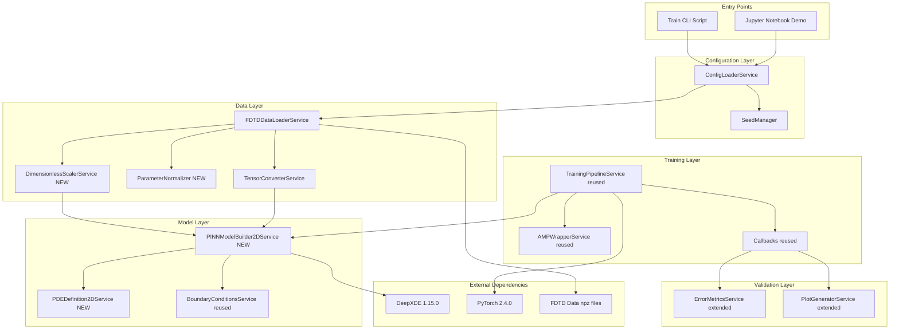
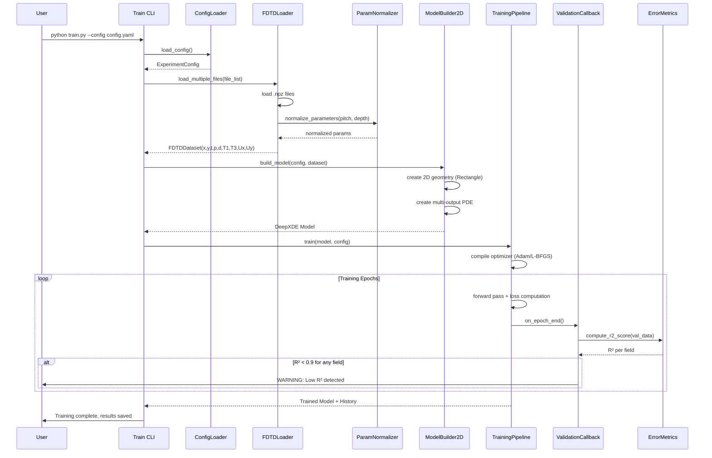

# 技術設計書

## 概要

**目的**: Phase 1で構築したPINN基盤を2次元弾性波物理に拡張し、FDTDシミュレーションデータを用いた訓練およびクラックパラメータ(pitch、depth)に対するパラメトリック学習を実現する。

**ユーザー**: 物理シミュレーション開発者がPINN based超音波伝播モデルを構築し、FDTD ground truthとの比較検証を行う。

**影響**: Phase 1の1D解析解検証から実用的な2DシミュレータへShift。FDTDデータ統合により数値実験が可能になり、クラック形状パラメータ空間の内挿予測が実現される。

### ゴール
- 2D弾性波方程式(縦波・横波)を満たすPINNモデルを実装し、T1/T3応力場とUx/Uy変位場の同時予測を実現する
- `/PINN_data/`のFDTD .npzファイル(12ファイル: 4 pitch × 3 depth)を訓練データとして統合し、パラメトリック学習を実施する
- R²スコアによる定量評価で各出力場の予測精度を測定し、R² ≥ 0.9を達成する
- Phase 1基盤(GPU加速、設定管理、損失関数チューニング)を再利用し、開発効率を最大化する

### 非ゴール
- 3次元波動伝播(Phase 2スコープ外、将来Phase 3以降で検討)
- リアルタイム推論最適化(本番環境デプロイはPhase 4スコープ)
- クラック検出アルゴリズム実装(逆問題は順問題検証後のフェーズで追加)
- 過度なテストコード作成(Phase 1反省: 要求6に基づき重要機能に絞る)
- パラメータ外挿(訓練範囲外予測は現状のデータ量では困難、内挿性能を優先目標とする)

## アーキテクチャ

### 既存アーキテクチャ分析

Phase 1で実装済みの基盤コンポーネント(pinn-1d-foundation)は以下のService指向設計を採用:

**既存パターン**:
- **Service層**: 各モジュールを`*Service`クラスとして実装(PINNModelBuilderService、TrainingPipelineService等)
- **設定管理**: YAML + Pydanticバリデーション(ConfigLoaderService)
- **GPU最適化**: PyTorch AMP wrapper(AMPWrapperService)、CUDA自動検出
- **再現性**: シード管理(SeedManager)、実験ディレクトリ管理(ExperimentManager)
- **検証**: 解析解生成(AnalyticalSolutionGeneratorService)、誤差計算(ErrorMetricsService)
- **データ**: FDTDローダー(FDTDDataLoaderService)、テンソル変換(TensorConverterService)

**再利用可能なコンポーネント**:
1. `pinn/training/`: TrainingPipelineService、AMPWrapperService、Callbacks(Loss logging、Checkpoint、Divergence detection)
2. `pinn/utils/`: ConfigLoaderService、SeedManager、ExperimentManager、MetadataLogger
3. `pinn/data/`: FDTDDataLoaderService、TensorConverterService(拡張が必要)
4. `pinn/validation/`: ErrorMetricsService(R²スコア追加)、PlotGeneratorService
5. `pinn/tuning/`: WeightTuningFrameworkService(損失重み最適化)

**統合制約**:
- Phase 1のディレクトリ構造(`/pinn/models/`, `/pinn/training/`, `/pinn/validation/`, `/pinn/data/`)を維持
- Service命名規則(`*Service`クラス)およびsnake_caseファイル名規則を遵守
- DeepXDE 1.15.0、PyTorch 2.4.0、CUDA 12.4との互換性維持

### アーキテクチャパターンと境界マップ



**アーキテクチャ統合**:
- **選択パターン**: Layered Service Architecture(Phase 1継承)、各層がService interfaceを通じて疎結合
- **ドメイン境界**:
  - Data層: FDTDファイルI/O、パラメータ正規化、テンソル変換
  - Model層: DeepXDEモデル構築、PDE定義、境界条件
  - Training層: 訓練ループ、GPU最適化、Callback処理
  - Validation層: 誤差計算、可視化
- **既存パターン保持**: Phase 1のService命名規則、YAML設定駆動、GPU自動検出を維持
- **新規コンポーネント根拠**:
  - `PINNModelBuilder2DService`: 2D geometry(Rectangle)と5D入力(x,y,t,p,d)対応のため1D版から拡張
  - `PDEDefinition2DService`: 2D弾性波方程式(4出力)のPDE residual計算のため新規作成
  - `ParameterNormalizer`: パラメータ(pitch, depth)を[0,1]正規化するユーティリティ
  - `DimensionlessScalerService`: 損失スケール問題解決のため、全変数を無次元化(過去の実験で損失項が巨大化する問題に対処)
- **Steering準拠**: "Reference-driven development"原則に従い、Phase 1実装を基準として段階的拡張

### テクノロジースタック

| Layer | Choice / Version | Role in Feature | Notes |
|-------|------------------|-----------------|-------|
| Backend / Services | Python 3.11+ | 実装言語 | Phase 1継承 |
| Deep Learning | PyTorch 2.4.0 | ニューラルネットワークバックエンド | 自動微分、CUDA対応 |
| PINN Framework | DeepXDE 1.15.0 | 2D geometry、PDE、BC定義 | Rectangle + GeometryXTime |
| GPU Runtime | CUDA 12.4 | GPU加速 | PyTorch CUDA backend |
| Numerical Ops | NumPy <2.0, CuPy 13.3.0 | データ処理、GPU配列操作 | .npz読み込み、LHS sampling |
| Validation Metrics | scikit-learn 1.8.0 | R²スコア計算 | sklearn.metrics.r2_score |
| Configuration | PyYAML, Pydantic 2.x | YAML設定ファイル管理 | Phase 1と同じ |
| Visualization | Matplotlib 3.9.2, Seaborn 0.13.2 | 波動場プロット、誤差ヒートマップ | 複数時刻スナップショット |
| Testing | pytest 9.x, pytest-cov | 重要機能の単体/統合テスト | カバレッジ50%目標 |

**技術選定根拠**:
- **DeepXDE 1.15.0**: 2D Rectangle geometryおよびGeometryXTime APIサポート、multi-output FNNネイティブ対応
- **scikit-learn追加**: R²スコア計算のため新規依存関係(requirements.txtに追加、オプショナル依存として扱う)
- **既存スタック維持**: Phase 1との互換性を最大化し、トラブルシューティングコストを削減

詳細な選定理由、ベンチマーク比較、API互換性調査は`research.md`の「Technology Research」セクション参照。

## システムフロー

### 訓練ワークフローシーケンス



**フロー設計判断**:
- **Gating条件**: ValidationCallbackでR² < 0.9の場合に警告発行(要求4.5)
- **リトライなし**: 訓練は1回実行、失敗時はユーザーがハイパーパラメータ調整して再実行
- **非同期処理なし**: 訓練は同期実行(DeepXDE仕様)、並列化はPhase 4スコープ

### データ読み込みとパラメータ正規化フロー

```mermaid
flowchart TD
    Start[Load Config] --> ListFiles[List .npz files in /PINN_data/]
    ListFiles --> FilterFiles{Filter by pitch/depth range}
    FilterFiles -->|Match| LoadNPZ[Load .npz file]
    FilterFiles -->|No match| Skip[Skip file]
    LoadNPZ --> ExtractMeta[Extract pitch, depth from metadata]
    ExtractMeta --> NormParams[Normalize: pitch→[0,1], depth→[0,1]]
    NormParams --> Stack[Stack (x,y,t,p_norm,d_norm)]
    Stack --> Concat[Concatenate all files]
    Concat --> TrainValSplit[Train/Val split 80/20, seed=42]
    TrainValSplit --> ToTensor[Convert to PyTorch Tensor]
    ToTensor --> End[Return DataLoader]
    Skip --> ListFiles
```

**Key Decisions**:
- パラメータフィルタリング: pitch ∈ [1.25, 2.0]mm、depth ∈ [0.1, 0.3]mm範囲外のファイルは除外(要求2.2)
- 正規化方式: pitch_norm = (p - 1.25) / (2.0 - 1.25)、depth_norm = (d - 0.1) / (0.3 - 0.1)
- エラーハンドリング: .npz不正形式時はValueError発生(要求2.7)

## 要求トレーサビリティ

| Requirement | Summary | Components | Interfaces | Flows |
|-------------|---------|------------|------------|-------|
| 1.1, 1.2, 1.3 | 2D弾性波PDE + 空間時間ドメイン + 4出力 | PDEDefinition2DService, PINNModelBuilder2DService | PDEFunctionInterface, GeometryInterface | 訓練ワークフロー |
| 1.4 | Phase 1拡張設計 | PINNModelBuilder2DService | ModelBuilderInterface | - |
| 1.5 | 弾性定数設定 | ConfigLoaderService, PDEDefinition2DService | ElasticConfig | - |
| 2.1, 2.2, 2.3 | FDTDデータロード + フィルタ + 抽出 | FDTDDataLoaderService, TensorConverterService | DataLoaderInterface | データ読み込みフロー |
| 2.4, 2.5 | 訓練統合 + 分割 | TrainingPipelineService, FDTDDataLoaderService | TrainingDataInterface | 訓練ワークフロー |
| 2.6 | サンプリング密度対応 | FDTDDataLoaderService | - | - |
| 2.7 | エラーハンドリング | FDTDDataLoaderService | - | データ読み込みフロー |
| 3.1, 3.2, 3.3 | Conditional PINN(5D入力) + パラメータ混合訓練 | ParameterNormalizer, PINNModelBuilder2DService, TrainingPipelineService | ConditionalPINNInterface | 訓練ワークフロー |
| 3.4, 3.5 | 内挿予測 + Holdout検証 | ValidationCallback, ErrorMetricsService | ValidationInterface | 訓練ワークフローValidationCallback |
| 3.6 | 外挿スコープ認識 | - | - | - |
| 4.1, 4.2 | L2/相対誤差 + R²スコア | ErrorMetricsService | MetricsInterface | 訓練ワークフローCallback |
| 4.3, 4.4 | Per-field R² + 可視化 | ErrorMetricsService, PlotGeneratorService | PlotInterface | Callback, Notebook |
| 4.5 | R² < 0.9警告 | ValidationCallback | - | 訓練ワークフローCallback |
| 4.6 | 誤差ヒートマップ | PlotGeneratorService | PlotInterface | Notebook |
| 5.1, 5.2, 5.3, 5.4, 5.5, 5.6 | Phase 1再利用(Pipeline, AMP, Config, Callbacks, Tuning, 構造維持) | TrainingPipelineService, AMPWrapperService, ConfigLoaderService, Callbacks, WeightTuningFrameworkService | - | - |
| 6.1, 6.2, 6.3, 6.4, 6.5, 6.6 | 簡素化テスト戦略 | test_pde_residual.py, test_fdtd_loader.py, test_r2_score.py, test_integration_2d.py | - | - |
| 7.1, 7.2, 7.3, 7.4, 7.5, 7.6, 7.7, 7.8 | Notebook順問題デモ | /notebooks/wave_2d_forward_demo.ipynb | - | Notebook実行フロー |
| 8.1, 8.2, 8.3, 8.4, 8.5, 8.6 | 再現性と実験管理 | ExperimentManager, SeedManager, MetadataLogger | - | 訓練ワークフロー |

## コンポーネントとインターフェース

### コンポーネント概要

| Component | Domain/Layer | Intent | Req Coverage | Key Dependencies (P0/P1) | Contracts |
|-----------|--------------|--------|--------------|--------------------------|-----------|
| PINNModelBuilder2DService | Model | 2D geometry + 5D入力PINN構築 | 1.1, 1.2, 1.3, 1.4, 1.5, 3.1, 3.2 | DeepXDE (P0), PDEDefinition2DService (P0) | Service |
| PDEDefinition2DService | Model | 2D弾性波PDE residual計算(無次元) | 1.1, 1.5 | DeepXDE grad (P0), DimensionlessScalerService (P0) | Service |
| DimensionlessScalerService | Data | 全変数無次元化・損失スケール正規化 | 全要求(横断的) | NumPy (P0) | Service |
| ParameterNormalizer | Data | パラメータ正規化 | 3.1, 3.2 | NumPy (P0) | Service |
| FDTDDataLoaderService | Data | 複数.npzファイル読み込み(拡張) | 2.1, 2.2, 2.3, 2.4, 2.5, 2.6, 2.7, 3.3 | NumPy (P0), ParameterNormalizer (P0), DimensionlessScalerService (P0) | Service |
| ErrorMetricsService | Validation | L2/相対誤差 + R²スコア | 4.1, 4.2, 4.3 | NumPy (P0), sklearn (P1) | Service |
| PlotGeneratorService | Validation | 時系列スナップショット + ヒートマップ | 4.4, 4.6 | Matplotlib (P0) | Service |
| ValidationCallback | Training | R²計算 + 警告発行 | 3.5, 4.3, 4.5 | ErrorMetricsService (P0) | Event |
| TrainingPipelineService | Training | Phase 1再利用 | 5.1, 5.2 | DeepXDE (P0), AMPWrapperService (P1) | Service |
| Train CLI Script | Entry Point | 訓練実行エントリーポイント | 全要求 | 全Service (P0) | Batch |

**依存関係の優先度**:
- **P0 (Blocking)**: コンポーネント動作に必須、欠如時は機能停止
- **P1 (High-risk)**: 非機能要求達成に重要、欠如時は性能劣化
- **P2 (Informational)**: 補助的機能、欠如時も主機能は動作

### Model Layer

#### PINNModelBuilder2DService

| Field | Detail |
|-------|--------|
| Intent | 2D spatiotemporal geometry + 5D入力(x,y,t,pitch,depth)のConditional PINNを構築 |
| Requirements | 1.1, 1.2, 1.3, 1.4, 1.5, 3.1, 3.2 |
| Owner / Reviewers | Model team |

**Responsibilities & Constraints**
- 2D Rectangle geometryとTimeDomainをGeometryXTimeで結合
- Multi-output FNN(4出力: T1, T3, Ux, Uy)を構築
- PDEDefinition2DServiceから2D弾性波PDE関数を取得
- Phase 1のPINNModelBuilderServiceを継承し、geometry作成ロジックのみ1D→2Dに変更
- Domain boundary: DeepXDEモデル構築のみ担当、訓練ロジックはTrainingPipelineServiceに委譲

**Dependencies**
- **Inbound**: Train CLI Script — モデル構築要求 (P0)
- **Outbound**: PDEDefinition2DService — PDE関数取得 (P0)
- **Outbound**: BoundaryConditionsService — BC定義(Phase 1再利用、今回はBCなし) (P2)
- **External**: DeepXDE 1.15.0 — geometry.Rectangle, GeometryXTime, nn.FNN (P0)

外部依存の詳細調査(Rectangle APIシグネチャ、GeometryXTimeコンストラクタ)は`research.md`の「DeepXDE 2D Geometry」セクション参照。

**Contracts**: Service [X] / API [ ] / Event [ ] / Batch [ ] / State [ ]

##### Service Interface
```python
from typing import Callable
import deepxde as dde
from pinn.utils.config_loader import ExperimentConfig

class PINNModelBuilder2DService:
    """2D elastic wave PINN model builder."""

    def build_model(
        self,
        config: ExperimentConfig,
        compile_model: bool = True
    ) -> dde.Model:
        """Construct 2D PINN model with 5D input and 4 outputs.

        Args:
            config: Experiment configuration with domain, network, elastic constants
            compile_model: If True, compile with optimizer (default: True)

        Returns:
            dde.Model ready for training

        Preconditions:
            - config.domain.x_max, y_max must define valid Rectangle
            - config.domain.wave_speed, elastic_lambda, elastic_mu, density must be positive
            - config.network.layer_sizes[-1] == 4 (outputs: T1, T3, Ux, Uy)
            - config.network.layer_sizes[0] == 5 (inputs: x, y, t, pitch, depth)

        Postconditions:
            - Returns compiled dde.Model with 2D GeometryXTime geometry
            - Model PDE function from PDEDefinition2DService
            - Model ready for training via TrainingPipelineService

        Invariants:
            - Geometry spatial bounds match config.domain
            - Network input/output dimensions match 5D/4D specification
        """
        ...

    def _create_geometry(self, domain: DomainConfig) -> dde.geometry.GeometryXTime:
        """Create 2D Rectangle × Time spatiotemporal domain.

        Returns:
            GeometryXTime for [x_min, x_max] × [y_min, y_max] × [t_min, t_max]
        """
        ...

    def _create_network(self, network_config: NetworkConfig) -> dde.nn.FNN:
        """Create multi-output FNN with layer_sizes = [5, 64, 64, 64, 4]."""
        ...
```

- **Preconditions**: config検証済み(ConfigLoaderServiceでPydanticバリデーション完了)、layer_sizes正しい次元
- **Postconditions**: DeepXDE Modelオブジェクト返却、compile済み(compile_model=True時)
- **Invariants**: geometry境界がconfig.domainと一致、ネットワークI/O次元が5D/4D

**Implementation Notes**
- **Integration**: Phase 1の`PINNModelBuilderService`を継承し、`_create_geometry()`のみオーバーライド(1D Interval → 2D Rectangle)
- **Validation**: layer_sizes[0]==5、layer_sizes[-1]==4をassertで事前チェック
- **Risks**: Rectangle APIがDeepXDE 1.15.0でサポートされていることを確認済み(`research.md`参照)、APIシグネチャ変更リスクは低い

#### PDEDefinition2DService

| Field | Detail |
|-------|--------|
| Intent | 2D弾性波方程式の**無次元**PDE residualを計算し、4出力(T1, T3, Ux, Uy)に対するPDE制約を提供 |
| Requirements | 1.1, 1.5 |

**Responsibilities & Constraints**
- **無次元化縦波方程式**: ∂²Ũx/∂t̃² - (∂²Ũx/∂x̃² + ∂²Ũx/∂ỹ²) = 0 (係数O(1))
- **無次元化横波方程式**: ∂²Ũy/∂t̃² - (c_t/c_l)² (∂²Ũy/∂x̃² + ∂²Ũy/∂ỹ²) = 0 (係数O(1))
- 応力residual簡略化: T̃1, T̃3のPDE residualは0(FDTDデータ監視に依存)
- DeepXDE `dde.grad.hessian(y, x, i, j)`を用いた2階微分計算(無次元座標で)
- Domain boundary: PDE residual計算のみ、BC/IC定義は他Serviceに委譲
- **損失スケール対策**: 無次元化によりPDE residualがO(1)、data lossと同スケールに

**Dependencies**
- **Inbound**: PINNModelBuilder2DService — PDE関数取得 (P0)
- **Inbound**: DimensionlessScalerService — 特性スケール取得(c_l, c_t計算用) (P0)
- **External**: DeepXDE grad module — Hessian計算 (P0)

**Contracts**: Service [X] / API [ ] / Event [ ] / Batch [ ] / State [ ]

##### Service Interface
```python
import deepxde as dde
import torch

class PDEDefinition2DService:
    """2D elastic wave equation PDE definition service (non-dimensionalized)."""

    @staticmethod
    def create_pde_function(
        elastic_lambda: float,
        elastic_mu: float,
        density: float
    ) -> Callable:
        """Create 2D elastic wave PDE function for DeepXDE (dimensionless form).

        Args:
            elastic_lambda: Lamé's first parameter (Pa)
            elastic_mu: Shear modulus (Pa)
            density: Material density (kg/m³)

        Returns:
            PDE function with signature (x, y) -> residual
            where x: (N, 5) dimensionless input [x̃, ỹ, t̃, pitch_norm, depth_norm]
                  y: (N, 4) dimensionless output [T̃1, T̃3, Ũx, Ũy]
                  residual: (N, 4) PDE residual for each output (O(1) scale)

        Preconditions:
            - elastic_lambda, elastic_mu, density > 0

        Postconditions:
            - Returns callable compatible with dde.data.PDE
            - Residual shape matches output shape (N, 4)
            - **All PDE coefficients O(1)** (addresses loss scaling problem)

        Invariants:
            - PDE residual = 0 at true solution (physics constraint)
        """
        # Compute wave speeds
        c_l = ((elastic_lambda + 2*elastic_mu) / density) ** 0.5  # Longitudinal
        c_t = (elastic_mu / density) ** 0.5  # Transverse

        # Dimensionless wave speed ratio
        c_ratio = c_t / c_l  # ≈ 0.49 for Aluminum

        def pde(x, y):
            """Compute PDE residual for 2D elastic wave equations (dimensionless).

            x: (N, 5) [x̃, ỹ, t̃, pitch_norm, depth_norm] (all dimensionless)
            y: (N, 4) [T̃1, T̃3, Ũx, Ũy] (all dimensionless)
            Returns: (N, 4) [residual_T̃1, residual_T̃3, residual_Ũx, residual_Ũy]

            Note: Input already normalized by DimensionlessScalerService
            """
            # Extract outputs (already dimensionless)
            T1_tilde = y[:, 0:1]
            T3_tilde = y[:, 1:2]
            Ux_tilde = y[:, 2:3]
            Uy_tilde = y[:, 3:4]

            # Compute spatial derivatives (Hessian) w.r.t. dimensionless coords
            Ux_xx = dde.grad.hessian(y, x, component=2, i=0, j=0)  # ∂²Ũx/∂x̃²
            Ux_yy = dde.grad.hessian(y, x, component=2, i=1, j=1)  # ∂²Ũx/∂ỹ²
            Uy_xx = dde.grad.hessian(y, x, component=3, i=0, j=0)  # ∂²Ũy/∂x̃²
            Uy_yy = dde.grad.hessian(y, x, component=3, i=1, j=1)  # ∂²Ũy/∂ỹ²

            # Temporal derivatives w.r.t. dimensionless time
            Ux_tt = dde.grad.hessian(y, x, component=2, i=2, j=2)  # ∂²Ũx/∂t̃²
            Uy_tt = dde.grad.hessian(y, x, component=3, i=2, j=2)  # ∂²Ũy/∂t̃²

            # Dimensionless PDE residuals (coefficients are O(1))
            # Longitudinal wave: ∂²Ũx/∂t̃² - (∂²Ũx/∂x̃² + ∂²Ũx/∂ỹ²) = 0
            # (coefficient = 1 due to T_ref = L_ref/c_l by design)
            residual_Ux = Ux_tt - (Ux_xx + Ux_yy)

            # Transverse wave: ∂²Ũy/∂t̃² - (c_t/c_l)² (∂²Ũy/∂x̃² + ∂²Ũy/∂ỹ²) = 0
            # (coefficient ≈ 0.24 for Aluminum, still O(1))
            residual_Uy = Uy_tt - c_ratio**2 * (Uy_xx + Uy_yy)

            # Stress residuals (simplified: assume FDTD data provides stress supervision)
            residual_T1 = torch.zeros_like(T1_tilde)
            residual_T3 = torch.zeros_like(T3_tilde)

            return torch.cat([residual_T1, residual_T3, residual_Ux, residual_Uy], dim=1)

        return pde
```

- **Preconditions**: 弾性定数が正値(configバリデーションで保証)、入力が無次元化済み
- **Postconditions**: 4次元residualベクトル返却、**residualスケールO(1)**
- **Invariants**: PDE residualが物理的に正しい解でゼロ、無次元化により係数O(1)

**Implementation Notes**
- **Integration**:
  - 入力xはDimensionlessScalerServiceで既に無次元化済み(x̃, ỹ, t̃)
  - 出力yも無次元化済み(T̃1, T̃3, Ũx, Ũy)
  - PDE係数が自動的にO(1)になり、PDE loss ≈ data lossのスケールに
  - 応力residualは簡略化(residual=0)、FDTDデータ監視損失で補完
- **Validation**:
  - Hessian計算の次元チェック(component index範囲確認)
  - c_ratio = c_t/c_l ≈ 0.49(Al 6061)がO(1)であることを確認
  - 訓練初期にPDE loss, data loss, BC lossのオーダーをログ記録し、O(1)であることを検証
- **Risks**:
  - 応力residual省略によりphysics constraint弱化 → R²スコアで影響評価
  - c_ratio選択ミス(μ, λ取り違え) → 単体テストで検証

### Data Layer

#### DimensionlessScalerService

| Field | Detail |
|-------|--------|
| Intent | 損失スケール問題解決のため、全変数(x,y,t,outputs)を特性スケールで無次元化し、PDE係数をO(1)に統一 |
| Requirements | 全要求(横断的、訓練安定性に影響) |
| Owner / Reviewers | Data team, Model team |

**Responsibilities & Constraints**
- 特性スケール定義: L_ref(空間), T_ref(時間), U_ref(変位), σ_ref(応力)をFDTDデータ統計と物理パラメータから決定
- 入力変数無次元化: (x, y, t) → (x̃, ỹ, t̃) where x̃ = x/L_ref, etc.
- 出力変数無次元化: (T1, T3, Ux, Uy) → (T̃1, T̃3, Ũx, Ũy) where Ũx = Ux/U_ref, etc.
- 逆変換提供: 推論結果を物理単位に戻すdenormalize_outputs()
- Domain boundary: スケーリング変換のみ、データロードはFDTDLoaderに委譲、PDE定義はPDEDefinitionに委譲
- **過去の問題解決**: Phase 1で観測されたPDE loss >> data loss(桁違い)問題を根本解決

**Dependencies**
- **Inbound**: FDTDDataLoaderService — データスケーリング要求 (P0)
- **Inbound**: PDEDefinition2DService — 無次元PDE係数取得 (P0)
- **Inbound**: PlotGeneratorService — 物理単位への逆変換 (P1)
- **External**: NumPy — 数値演算 (P0)

**Contracts**: Service [X] / API [ ] / Event [ ] / Batch [ ] / State [ ]

##### Service Interface
```python
import numpy as np
from dataclasses import dataclass

@dataclass
class CharacteristicScales:
    """Characteristic scales for non-dimensionalization."""
    L_ref: float  # Spatial scale (m)
    T_ref: float  # Temporal scale (s)
    U_ref: float  # Displacement scale (m)
    sigma_ref: float  # Stress scale (Pa)

    # Derived quantities
    velocity_ref: float  # = L_ref / T_ref (m/s)

    @classmethod
    def from_physics(
        cls,
        domain_length: float,
        elastic_lambda: float,
        elastic_mu: float,
        density: float,
        displacement_amplitude: float = 1e-9
    ) -> 'CharacteristicScales':
        """Compute characteristic scales from physics.

        Args:
            domain_length: Spatial domain size (x_max), m
            elastic_lambda: Lamé's first parameter, Pa
            elastic_mu: Shear modulus, Pa
            density: Material density, kg/m³
            displacement_amplitude: Typical displacement (from FDTD stats), m

        Returns:
            CharacteristicScales with derived scales
        """
        L_ref = domain_length
        c_l = np.sqrt((elastic_lambda + 2*elastic_mu) / density)  # Longitudinal wave speed
        T_ref = L_ref / c_l
        U_ref = displacement_amplitude
        sigma_ref = density * c_l**2  # Characteristic impedance

        return cls(
            L_ref=L_ref,
            T_ref=T_ref,
            U_ref=U_ref,
            sigma_ref=sigma_ref,
            velocity_ref=c_l
        )

class DimensionlessScalerService:
    """Non-dimensionalization service for loss scaling."""

    def __init__(self, scales: CharacteristicScales):
        """Initialize scaler with characteristic scales.

        Args:
            scales: Characteristic scales from physics or data

        Preconditions:
            - All scales > 0
        """
        self.scales = scales

    def normalize_inputs(
        self,
        x: np.ndarray,
        y: np.ndarray,
        t: np.ndarray
    ) -> tuple[np.ndarray, np.ndarray, np.ndarray]:
        """Normalize spatial and temporal coordinates.

        Args:
            x: x-coordinates (N,) in meters
            y: y-coordinates (N,) in meters
            t: time coordinates (N,) in seconds

        Returns:
            (x_tilde, y_tilde, t_tilde) dimensionless coordinates

        Postconditions:
            - x_tilde = x / L_ref ∈ [0, 1]
            - y_tilde = y / L_ref ∈ [0, 0.5]
            - t_tilde = t / T_ref ∈ [0.55, 1.02] for typical domain
        """
        x_tilde = x / self.scales.L_ref
        y_tilde = y / self.scales.L_ref
        t_tilde = t / self.scales.T_ref
        return x_tilde, y_tilde, t_tilde

    def normalize_outputs(
        self,
        T1: np.ndarray,
        T3: np.ndarray,
        Ux: np.ndarray,
        Uy: np.ndarray
    ) -> tuple[np.ndarray, np.ndarray, np.ndarray, np.ndarray]:
        """Normalize output fields.

        Args:
            T1, T3: Stress components (N,) in Pa
            Ux, Uy: Displacement components (N,) in m

        Returns:
            (T1_tilde, T3_tilde, Ux_tilde, Uy_tilde) dimensionless

        Postconditions:
            - T1_tilde, T3_tilde = O(1) (stress scaled by sigma_ref)
            - Ux_tilde, Uy_tilde = O(1) (displacement scaled by U_ref)
        """
        T1_tilde = T1 / self.scales.sigma_ref
        T3_tilde = T3 / self.scales.sigma_ref
        Ux_tilde = Ux / self.scales.U_ref
        Uy_tilde = Uy / self.scales.U_ref
        return T1_tilde, T3_tilde, Ux_tilde, Uy_tilde

    def denormalize_outputs(
        self,
        T1_tilde: np.ndarray,
        T3_tilde: np.ndarray,
        Ux_tilde: np.ndarray,
        Uy_tilde: np.ndarray
    ) -> tuple[np.ndarray, np.ndarray, np.ndarray, np.ndarray]:
        """Convert dimensionless outputs back to physical units.

        Args:
            T1_tilde, T3_tilde, Ux_tilde, Uy_tilde: Dimensionless outputs

        Returns:
            (T1, T3, Ux, Uy) in physical units (Pa, Pa, m, m)

        Postconditions:
            - Inverse of normalize_outputs
        """
        T1 = T1_tilde * self.scales.sigma_ref
        T3 = T3_tilde * self.scales.sigma_ref
        Ux = Ux_tilde * self.scales.U_ref
        Uy = Uy_tilde * self.scales.U_ref
        return T1, T3, Ux, Uy
```

- **Preconditions**: 特性スケールが正値、物理的に妥当
- **Postconditions**: 無次元変数がO(1)範囲、PDE係数がO(1)
- **Invariants**: normalize → denormalize で元の値復元(数値誤差を除く)

**Implementation Notes**
- **Integration**:
  - FDTDDataLoaderServiceでデータ読み込み直後にnormalize_inputs/outputs適用
  - PDEDefinition2DServiceで無次元PDEを計算(係数が自動的にO(1)になる)
  - PlotGeneratorServiceで可視化前にdenormalize_outputs適用
  - 特性スケールはconfig YAMLに記録、再現性保証
- **Validation**:
  - U_ref推定: FDTDデータのUx, Uy標準偏差をU_refとして使用(データ駆動)
  - σ_ref検証: ρ*c_l^2 ≈ 107 GPaがYoung's modulus E ≈ 70 GPaと同オーダーであることを確認
  - PDE係数確認: 無次元化後の∂²Ũx/∂t̃² - (∂²Ũx/∂x̃² + ∂²Ũx/∂ỹ²)の係数が1であることを検証
- **Risks**:
  - U_ref選択の感度: U_refが1桁ずれると変位場の学習が不安定化 → FDTDデータ統計で検証
  - 複数スケール存在: 縦波c_lと横波c_tで波速異なる → T_ref = L_ref/c_l (速い方)で統一

#### ParameterNormalizer

| Field | Detail |
|-------|--------|
| Intent | クラックパラメータ(pitch, depth)を[0, 1]範囲に正規化 |
| Requirements | 3.1, 3.2 |

**Responsibilities & Constraints**
- pitch正規化: (p - 1.25) / (2.0 - 1.25) → [0, 1]
- depth正規化: (d - 0.1) / (0.3 - 0.1) → [0, 1]
- 逆正規化機能提供(推論時にパラメータ復元)
- Domain boundary: パラメータスケーリングのみ、データロードはFDTDDataLoaderServiceに委譲

**Dependencies**
- **Inbound**: FDTDDataLoaderService — パラメータ正規化要求 (P0)
- **External**: NumPy — 数値演算 (P0)

**Contracts**: Service [X] / API [ ] / Event [ ] / Batch [ ] / State [ ]

##### Service Interface
```python
import numpy as np

class ParameterNormalizer:
    """Normalize crack parameters to [0, 1] range."""

    PITCH_MIN = 1.25e-3  # 1.25mm in meters
    PITCH_MAX = 2.0e-3   # 2.0mm in meters
    DEPTH_MIN = 0.1e-3   # 0.1mm in meters
    DEPTH_MAX = 0.3e-3   # 0.3mm in meters

    @staticmethod
    def normalize_pitch(pitch: np.ndarray) -> np.ndarray:
        """Normalize pitch to [0, 1].

        Args:
            pitch: Pitch values in meters

        Returns:
            Normalized pitch in [0, 1]

        Preconditions:
            - pitch in [PITCH_MIN, PITCH_MAX]

        Postconditions:
            - Output in [0, 1]
        """
        return (pitch - ParameterNormalizer.PITCH_MIN) / \
               (ParameterNormalizer.PITCH_MAX - ParameterNormalizer.PITCH_MIN)

    @staticmethod
    def normalize_depth(depth: np.ndarray) -> np.ndarray:
        """Normalize depth to [0, 1]."""
        return (depth - ParameterNormalizer.DEPTH_MIN) / \
               (ParameterNormalizer.DEPTH_MAX - ParameterNormalizer.DEPTH_MIN)

    @staticmethod
    def denormalize_pitch(pitch_norm: np.ndarray) -> np.ndarray:
        """Denormalize pitch from [0, 1] to meters."""
        return pitch_norm * (ParameterNormalizer.PITCH_MAX - ParameterNormalizer.PITCH_MIN) + \
               ParameterNormalizer.PITCH_MIN

    @staticmethod
    def denormalize_depth(depth_norm: np.ndarray) -> np.ndarray:
        """Denormalize depth from [0, 1] to meters."""
        return depth_norm * (ParameterNormalizer.DEPTH_MAX - ParameterNormalizer.DEPTH_MIN) + \
               ParameterNormalizer.DEPTH_MIN
```

- **Preconditions**: パラメータが範囲内(FDTDLoaderでフィルタ済み)
- **Postconditions**: [0, 1]正規化済み値
- **Invariants**: 正規化→逆正規化で元の値に復元

**Implementation Notes**
- **Integration**: FDTDDataLoaderServiceのload_multiple_files()内で呼び出し
- **Validation**: 範囲外値をclipまたはValueError発生
- **Risks**: なし(単純な線形変換)

#### FDTDDataLoaderService (拡張)

| Field | Detail |
|-------|--------|
| Intent | 複数.npzファイルを読み込み、パラメータ正規化とtrain/val分割を実施 |
| Requirements | 2.1, 2.2, 2.3, 2.4, 2.5, 2.6, 2.7, 3.3 |

**Responsibilities & Constraints**
- Phase 1のload_file()メソッド再利用
- 新規メソッド: load_multiple_files(file_paths) — 複数ファイル結合
- パラメータフィルタリング(pitch, depth範囲チェック)
- ParameterNormalizerによる正規化
- train/val split(80/20, seed=42)
- PyTorch Tensorへの変換(TensorConverterService利用)
- Domain boundary: データI/Oとフィルタのみ、モデル構築はModelLayerに委譲

**Dependencies**
- **Inbound**: Train CLI Script — データロード要求 (P0)
- **Outbound**: ParameterNormalizer — パラメータ正規化 (P0)
- **Outbound**: TensorConverterService — NumPy→PyTorch変換 (P0)
- **External**: NumPy — .npz読み込み (P0)

**Contracts**: Service [X] / API [ ] / Event [ ] / Batch [ ] / State [ ]

##### Service Interface
```python
from pathlib import Path
import numpy as np
from typing import List, Tuple
from dataclasses import dataclass

@dataclass
class FDTDDataset2D:
    """2D FDTD dataset with parameters."""
    x: np.ndarray  # (N,)
    y: np.ndarray  # (N,)
    t: np.ndarray  # (N,)
    pitch_norm: np.ndarray  # (N,) normalized
    depth_norm: np.ndarray  # (N,) normalized
    T1: np.ndarray  # (N,)
    T3: np.ndarray  # (N,)
    Ux: np.ndarray  # (N,)
    Uy: np.ndarray  # (N,)
    metadata: dict  # Original pitch/depth, file info

class FDTDDataLoaderService:
    """Extended FDTD data loader for 2D parametric PINN."""

    def load_multiple_files(
        self,
        file_paths: List[Path],
        pitch_range: Tuple[float, float] = (1.25e-3, 2.0e-3),
        depth_range: Tuple[float, float] = (0.1e-3, 0.3e-3)
    ) -> FDTDDataset2D:
        """Load and concatenate multiple .npz files.

        Args:
            file_paths: List of .npz file paths
            pitch_range: (min, max) pitch filter in meters
            depth_range: (min, max) depth filter in meters

        Returns:
            FDTDDataset2D with concatenated data from all files

        Preconditions:
            - All files exist and have valid .npz format

        Postconditions:
            - Returns concatenated dataset with normalized parameters
            - Filtered by pitch/depth range

        Invariants:
            - Output shapes: all arrays have length N = sum(n_samples_per_file)

        Raises:
            FileNotFoundError: If any file doesn't exist
            KeyError: If required keys missing in .npz
            ValueError: If .npz format invalid
        """
        ...

    def train_val_split(
        self,
        dataset: FDTDDataset2D,
        train_ratio: float = 0.8,
        seed: int = 42
    ) -> Tuple[FDTDDataset2D, FDTDDataset2D]:
        """Split dataset into train/validation sets.

        Returns:
            (train_dataset, val_dataset)

        Preconditions:
            - train_ratio in (0, 1)

        Postconditions:
            - train size ≈ train_ratio * total
            - Reproducible split with seed
        """
        ...
```

- **Preconditions**: ファイルパス有効、.npz形式正しい
- **Postconditions**: 結合済みデータセット、パラメータ正規化済み
- **Invariants**: 全配列が同じ長さN

**Implementation Notes**
- **Integration**: load_file()はPhase 1実装そのまま使用、load_multiple_files()で各ファイル読み込みループ
- **Validation**: ファイル存在確認、キー存在確認、パラメータ範囲チェック
- **Risks**: 12ファイル×~4.5MB = 54MB全メモリ読み込み、メモリ不足リスクは低い(GPU 8GB以上前提)

### Validation Layer

#### ErrorMetricsService (拡張)

| Field | Detail |
|-------|--------|
| Intent | Phase 1のL2/相対誤差に加え、R²スコア計算機能を追加 |
| Requirements | 4.1, 4.2, 4.3 |

**Responsibilities & Constraints**
- Phase 1メソッド維持: l2_error(), relative_error(), max_absolute_error()
- 新規メソッド: r2_score() — per-field R²計算
- sklearn.metrics.r2_scoreラッパー
- Domain boundary: 誤差計算のみ、可視化はPlotGeneratorServiceに委譲

**Dependencies**
- **Inbound**: ValidationCallback — R²スコア要求 (P0)
- **External**: NumPy — 数値演算 (P0)
- **External**: scikit-learn — r2_score (P1, オプショナル)

sklearnのAPI詳細、バージョン互換性は`research.md`の「R² Score Implementation」セクション参照。

**Contracts**: Service [X] / API [ ] / Event [ ] / Batch [ ] / State [ ]

##### Service Interface
```python
import numpy as np
from typing import Dict

class ErrorMetricsService:
    """Compute error metrics for PINN validation (extended from Phase 1)."""

    @staticmethod
    def r2_score(
        y_pred: np.ndarray,
        y_true: np.ndarray,
        per_output: bool = True
    ) -> Dict[str, float] | float:
        """Compute R² (coefficient of determination) score.

        Args:
            y_pred: Predicted values (N, 4) [T1, T3, Ux, Uy]
            y_true: True values (N, 4)
            per_output: If True, return dict with per-field R²

        Returns:
            Dict {'T1': r2_T1, 'T3': r2_T3, 'Ux': r2_Ux, 'Uy': r2_Uy}
            or float (average R²) if per_output=False

        Preconditions:
            - y_pred.shape == y_true.shape
            - y_pred.shape[1] == 4 (4 outputs)

        Postconditions:
            - R² in [-inf, 1.0] (1.0 = perfect, 0.0 = mean baseline, <0 = worse than mean)

        Invariants:
            - R² = 1 - SS_res / SS_tot where SS_res = Σ(y_pred - y_true)², SS_tot = Σ(y_true - ȳ)²
        """
        try:
            from sklearn.metrics import r2_score as sklearn_r2
        except ImportError:
            raise ImportError("sklearn not installed. Install with: pip install scikit-learn")

        if per_output:
            output_names = ['T1', 'T3', 'Ux', 'Uy']
            r2_dict = {}
            for i, name in enumerate(output_names):
                r2_dict[name] = sklearn_r2(y_true[:, i], y_pred[:, i])
            return r2_dict
        else:
            return sklearn_r2(y_true, y_pred, multioutput='uniform_average')

    # Phase 1 methods (unchanged)
    @staticmethod
    def l2_error(u_pred: np.ndarray, u_exact: np.ndarray) -> float:
        """Compute L2 norm of error (Phase 1)."""
        ...

    @staticmethod
    def relative_error(u_pred: np.ndarray, u_exact: np.ndarray) -> float:
        """Compute relative L2 error (Phase 1)."""
        ...
```

- **Preconditions**: 配列形状一致、4出力
- **Postconditions**: R²スコア辞書または平均値
- **Invariants**: R²定義式に従う

**Implementation Notes**
- **Integration**: ValidationCallbackのon_epoch_end()で呼び出し
- **Validation**: sklearn importエラーハンドリング、形状チェック
- **Risks**: sklearn依存追加(pyproject.tomlに追加、オプショナル依存として明記)

#### PlotGeneratorService (拡張)

| Field | Detail |
|-------|--------|
| Intent | Phase 1のプロット機能に加え、2D空間分布ヒートマップと時系列スナップショットを追加 |
| Requirements | 4.4, 4.6 |

**Responsibilities & Constraints**
- Phase 1メソッド維持: plot_training_loss()
- 新規メソッド: plot_spatial_heatmap() — 誤差分布2Dヒートマップ
- 新規メソッド: plot_time_snapshots() — 複数時刻での波動場比較
- Matplotlib/Seaborn使用
- Domain boundary: 可視化のみ、誤差計算はErrorMetricsServiceに委譲

**Dependencies**
- **Inbound**: Notebook, ValidationCallback — プロット生成要求 (P0)
- **External**: Matplotlib, Seaborn — プロット描画 (P0)

**Contracts**: Service [X] / API [ ] / Event [ ] / Batch [ ] / State [ ]

##### Service Interface
```python
import numpy as np
import matplotlib.pyplot as plt
from pathlib import Path
from typing import List

class PlotGeneratorService:
    """Generate visualizations for 2D PINN validation (extended from Phase 1)."""

    def plot_spatial_heatmap(
        self,
        x: np.ndarray,
        y: np.ndarray,
        error: np.ndarray,
        output_field: str,
        save_path: Path
    ) -> None:
        """Generate 2D heatmap of spatial error distribution.

        Args:
            x: x-coordinates (N,)
            y: y-coordinates (N,)
            error: Absolute error (N,)
            output_field: Field name ('T1', 'T3', 'Ux', 'Uy')
            save_path: Output file path

        Preconditions:
            - x, y, error have same length

        Postconditions:
            - Heatmap saved to save_path
        """
        ...

    def plot_time_snapshots(
        self,
        x: np.ndarray,
        y: np.ndarray,
        t_list: List[float],
        fdtd_data: np.ndarray,
        pinn_pred: np.ndarray,
        output_field: str,
        save_path: Path
    ) -> None:
        """Generate time-series snapshots comparing FDTD vs PINN.

        Args:
            x, y: Spatial coordinates
            t_list: List of time points to visualize
            fdtd_data: FDTD ground truth (N_total, 4)
            pinn_pred: PINN predictions (N_total, 4)
            output_field: Field name
            save_path: Output file path

        Preconditions:
            - len(t_list) >= 3 (minimum 3 snapshots per Requirement 7.4)

        Postconditions:
            - Multi-panel plot saved to save_path
        """
        ...
```

**Implementation Notes**
- **Integration**: Notebookから呼び出し、ValidationCallbackでも使用可能
- **Validation**: 座標配列長チェック、t_list長さ≥3
- **Risks**: 大規模プロット時のメモリ消費(10k点×3時刻は問題なし)

### Training Layer

#### ValidationCallback (新規)

| Field | Detail |
|-------|--------|
| Intent | 訓練中にR²スコアを計算し、R² < 0.9時に警告発行 |
| Requirements | 3.5, 4.3, 4.5 |

**Responsibilities & Constraints**
- DeepXDE callbackインターフェース実装
- Epoch終了時にvalidation dataでR²計算
- Per-field R²をログ記録
- R² < 0.9の場合に警告メッセージ出力
- Domain boundary: R²計算とログのみ、モデル訓練制御はTrainingPipelineに委譲

**Dependencies**
- **Inbound**: TrainingPipelineService — callback登録 (P0)
- **Outbound**: ErrorMetricsService — R²計算 (P0)
- **External**: DeepXDE — Callback base class (P0)

**Contracts**: Service [ ] / API [ ] / Event [X] / Batch [ ] / State [ ]

##### Event Contract
- **Published events**: なし(標準出力への警告メッセージ)
- **Subscribed events**: DeepXDE on_epoch_end()イベント
- **Ordering / delivery guarantees**: 各epoch終了時に同期実行

##### Service Interface
```python
import deepxde as dde
import numpy as np
from pinn.validation.error_metrics import ErrorMetricsService

class ValidationCallback(dde.callbacks.Callback):
    """Validation callback for R² score computation and warning."""

    def __init__(
        self,
        val_x: np.ndarray,
        val_y: np.ndarray,
        r2_threshold: float = 0.9,
        log_interval: int = 1000
    ):
        """Initialize validation callback.

        Args:
            val_x: Validation inputs (N_val, 5)
            val_y: Validation outputs (N_val, 4)
            r2_threshold: R² threshold for warning
            log_interval: Log R² every N epochs
        """
        self.val_x = val_x
        self.val_y = val_y
        self.r2_threshold = r2_threshold
        self.log_interval = log_interval
        self.metrics_service = ErrorMetricsService()

    def on_epoch_end(self):
        """Compute R² score and emit warning if below threshold."""
        epoch = self.model.train_state.epoch

        if epoch % self.log_interval == 0:
            # Predict on validation set
            y_pred = self.model.predict(self.val_x)

            # Compute per-field R²
            r2_scores = self.metrics_service.r2_score(y_pred, self.val_y, per_output=True)

            # Log R² scores
            print(f"Epoch {epoch} | R² scores: {r2_scores}")

            # Check threshold and warn
            for field, r2 in r2_scores.items():
                if r2 < self.r2_threshold:
                    print(f"WARNING: {field} R²={r2:.4f} < {self.r2_threshold}. "
                          f"Consider tuning hyperparameters (loss weights, learning rate, epochs).")
```

**Implementation Notes**
- **Integration**: TrainingPipelineServiceのcallbackリストに追加
- **Validation**: validation dataが空でないことを確認
- **Risks**: 毎epochのR²計算はコスト高、log_interval=1000でオーバーヘッド削減

### Entry Point Layer

#### Train CLI Script

| Field | Detail |
|-------|--------|
| Intent | 2D PINN訓練の実行エントリーポイント |
| Requirements | 全要求(統合実行) |

**Responsibilities & Constraints**
- YAML設定ファイル読み込み
- FDTDデータロード
- モデル構築
- 訓練実行
- 結果保存
- Domain boundary: 全Serviceのオーケストレーションのみ、個別機能は各Serviceに委譲

**Dependencies**
- **Outbound**: 全Service (P0)

**Contracts**: Service [ ] / API [ ] / Event [ ] / Batch [X] / State [ ]

##### Batch / Job Contract
- **Trigger**: `python pinn/training/train_2d.py --config configs/2d_elastic_wave.yaml`
- **Input / validation**: YAML設定ファイル(Pydanticバリデーション)
- **Output / destination**: `/experiments/exp_{timestamp}/` ディレクトリにチェックポイント、ログ、プロット保存
- **Idempotency & recovery**: 同じseedで再実行すれば同一結果、チェックポイントから再開可能(DeepXDE機能)

##### Batch Script Pseudocode
```python
# pinn/training/train_2d.py

import argparse
from pathlib import Path
from pinn.utils.config_loader import ConfigLoaderService
from pinn.utils.seed_manager import SeedManager
from pinn.data.fdtd_loader import FDTDDataLoaderService
from pinn.models.pinn_model_builder_2d import PINNModelBuilder2DService
from pinn.training.training_pipeline import TrainingPipelineService
from pinn.training.callbacks import ValidationCallback
from pinn.utils.experiment_manager import ExperimentManager

def main():
    # Parse arguments
    parser = argparse.ArgumentParser()
    parser.add_argument('--config', type=Path, required=True)
    args = parser.parse_args()

    # Load config
    config = ConfigLoaderService().load_config(args.config)

    # Set seed
    SeedManager.set_seed(config.seed)

    # Create experiment directory
    exp_dir = ExperimentManager.create_experiment_dir(config.experiment_name)

    # Load FDTD data
    fdtd_loader = FDTDDataLoaderService(data_dir=Path("/home/manat/project2/PINN_data"))
    file_list = list(Path("/home/manat/project2/PINN_data").glob("*.npz"))
    dataset = fdtd_loader.load_multiple_files(file_list)
    train_data, val_data = fdtd_loader.train_val_split(dataset, seed=config.seed)

    # Build model
    model_builder = PINNModelBuilder2DService()
    model = model_builder.build_model(config)

    # Setup callbacks
    val_callback = ValidationCallback(val_data.x, val_data.y)

    # Train
    pipeline = TrainingPipelineService()
    trained_model, history = pipeline.train(
        model=model,
        config=config.training,
        output_dir=exp_dir,
        callbacks=[val_callback]
    )

    print(f"Training complete. Results saved to {exp_dir}")

if __name__ == "__main__":
    main()
```

**Implementation Notes**
- **Integration**: 全Serviceを順次呼び出し
- **Validation**: argparse引数チェック、config存在確認
- **Risks**: エラーハンドリング不足(各Service内でValueError/FileNotFoundError発生)

## データモデル

### ドメインモデル

**Aggregates and transactional boundaries**:
- **FDTDDataAggregate**: 単一.npzファイルに対応するFDTDData + metadata(pitch, depth, seed)
  - トランザクション境界: ファイル読み込み単位(1ファイル = 1トランザクション)
  - 不変条件: 全配列長が一致、メタデータ範囲内

**Entities, value objects, domain events**:
- **Entity**: FDTDDataset2D(複数ファイル結合後のデータセット、IDなし)
- **Value Object**: (x, y, t, pitch_norm, depth_norm) 5次元入力ベクトル
- **Domain Events**: なし(静的データ、イベント駆動不要)

**Business rules & invariants**:
- パラメータ範囲: pitch ∈ [1.25, 2.0]mm、depth ∈ [0.1, 0.3]mm
- 正規化後: pitch_norm, depth_norm ∈ [0, 1]
- 配列長整合性: すべての配列が同じN

### 論理データモデル

**Structure Definition**:
- **FDTD .npzファイル構造**:
  - Arrays: x, y, t, T1, T3, Ux, Uy (各 (nt*nx*ny,))
  - Scalars: p (pitch), d (depth), w (width), seed
  - Integers: nx_sample, ny_sample, nt_sample
- **結合後データセット**:
  - Input: (N_total, 5) [x, y, t, pitch_norm, depth_norm]
  - Output: (N_total, 4) [T1, T3, Ux, Uy]
  - N_total = sum(nt_i * nx_i * ny_i) for all files

**Consistency & Integrity**:
- **Transaction boundaries**: ファイル読み込み単位(各ファイル独立)
- **Cascading rules**: なし(静的データ)
- **Temporal aspects**: バージョニング不要、seedによる再現性保証

### 物理データモデル

**For NumPy Compressed Archives (.npz)**:
- ファイルフォーマット: NumPy .npz(ZIP圧縮)
- キー命名規則: `x`, `y`, `t`, `T1`, `T3`, `Ux`, `Uy`, `p`, `d`, `w`, `seed`, `nx_sample`, `ny_sample`, `nt_sample`
- データ型: float64(座標・場データ)、int32(サンプル数)
- 圧縮率: 約50%(元データ~9MB → 圧縮後~4.5MB)

**For In-Memory Arrays (NumPy/PyTorch)**:
- メモリレイアウト: C-contiguous(行優先)
- 精度: float32(PyTorch訓練用)、float64(NumPy計算用)
- GPU転送: CPU NumPy → GPU PyTorch Tensor via TensorConverterService

### データコントラクトと統合

**API Data Transfer**:
- なし(CLIツール、Web APIなし)

**Event Schemas**:
- なし(イベント駆動なし)

**Cross-Service Data Management**:
- FDTDDataLoaderService → PINNModelBuilder2DService: NumPy配列渡し
- NumPy → PyTorch変換: TensorConverterService経由
- 分散トランザクション不要(単一プロセス実行)

## エラーハンドリング

### エラー戦略

具体的なエラーハンドリングパターンと回復メカニズム:

### エラーカテゴリと対応

**User Errors(4xx相当)**:
- **Invalid config file**: ConfigLoaderServiceでPydantic ValidationError → ユーザーにYAMLエラー箇所表示
- **File not found**: FDTDDataLoaderServiceでFileNotFoundError → ファイルパスを確認するようメッセージ表示
- **Parameter out of range**: ParameterNormalizerで範囲外値検出 → ValueError with valid range guidance

**System Errors(5xx相当)**:
- **GPU out of memory**: PyTorch CUDA OOM → AMPWrapperServiceが検出、num_domain削減を提案
- **DeepXDE API incompatibility**: DeepXDE 1.15.0との非互換検出 → バージョン確認メッセージ
- **Numerical instability (NaN loss)**: DivergenceDetectionCallbackが検出 → 学習率削減推奨

**Business Logic Errors(422相当)**:
- **R² < threshold**: ValidationCallbackが検出 → ハイパーパラメータチューニング推奨メッセージ
- **Insufficient training data**: FDTDLoaderで12ファイル未満検出 → データ追加ガイダンス

### モニタリング

- **Error tracking**: 標準出力ログ(TrainingPipelineServiceのlogging module)
- **Logging**: エポックごとのloss、R²スコア、GPU使用率(CheckpointCallback)
- **Health monitoring**: なし(オフライン訓練ツール、リアルタイム監視不要)

## テスト戦略

Phase 1の反省(要求6)に基づき、重要機能に絞った簡素化テスト戦略を採用。

### 単体テスト(重要コンポーネントのみ)
1. **test_pde_residual_2d.py**: PDEDefinition2DService.create_pde_function()
   - PDE residual計算の次元確認
   - 既知解(線形波)でresidual≈0を検証
   - Hessian計算の正確性チェック

2. **test_fdtd_loader_2d.py**: FDTDDataLoaderService.load_multiple_files()
   - 複数ファイル結合の配列長整合性
   - パラメータフィルタリング正確性
   - エラーハンドリング(存在しないファイル、不正形式)

3. **test_r2_score.py**: ErrorMetricsService.r2_score()
   - 完全一致でR²=1.0
   - ランダム予測でR²≈0
   - Per-field R²計算の正確性

4. **test_parameter_normalizer.py**: ParameterNormalizer
   - 正規化→逆正規化で元の値復元
   - 範囲境界値(1.25, 2.0, 0.1, 0.3)の正確性

### 統合テスト(エンドツーエンドシナリオ)
1. **test_integration_2d_training.py**: 小規模データセットでの訓練→検証
   - 2ファイル(p1250_d100, p1500_d200)のみ使用
   - 100 epochs訓練実行
   - R²スコア計算成功
   - チェックポイント保存確認
   - **実データ使用**(Phase 1のモック過剰反省)

### Notebook実行テスト
1. **notebooks/wave_2d_forward_demo.ipynb実行**:
   - 全セルエラーなく完了
   - FDTD vs PINNプロット生成
   - R²スコア表示
   - **実装とnotebookの整合性保証**(要求6.3)

### パフォーマンステスト(非機能要求検証)
1. **test_training_time_2d.py**:
   - 10k collocation points、5k epochs訓練時間測定
   - 目標: GPU上で30分以内(非機能要求)
   - GPU memory usage < 8GB確認

2. **test_data_loading_time.py**:
   - 12ファイル読み込み時間測定
   - 目標: 10秒以内(非機能要求)

### テストカバレッジ
- **目標**: 50%(Phase 1の70%から引き下げ、要求6.6)
- **重点領域**: PDE residual、データローディング、R²スコア、統合フロー
- **除外**: Phase 1再利用コンポーネント(既にテスト済み)、可視化コード

## セキュリティ考慮事項

本フェーズはオフライン研究ツール開発のため、セキュリティ脅威は限定的。以下は最小限の考慮事項:

- **Data Validation**: .npzファイル読み込み時にKeyError/ValueError捕捉、任意コード実行リスクなし(NumPy .load()は安全)
- **File Path Handling**: Path traversal攻撃対策不要(ローカル実行、外部入力なし)
- **Authentication**: 不要(単一ユーザーツール)
- **Sensitive Data**: FDTDデータは研究用途、個人情報含まず

## パフォーマンスとスケーラビリティ

### ターゲットメトリクスと測定戦略

**Performance Targets(非機能要求より)**:
- 2D PINN訓練(10k collocation points、5k epochs): GPU上で30分以内
- FDTD 12ファイル読み込み(約56MB): 10秒以内
- PINN推論(1000点グリッド): 1秒以内

**測定戦略**:
- CheckpointCallbackで訓練時間記録
- FDTDLoaderにタイマー追加(load開始→終了時刻)
- 推論時間はNotebookで`%%timeit`測定

### スケーリングアプローチ

**Phase 2スコープ(現在)**:
- **水平スケーリング**: なし(単一GPU実行)
- **垂直スケーリング**: GPU RAMに依存(8-16GB想定)、num_domain調整でメモリ制御

**将来Phase 4スコープ**:
- 分散訓練(multi-GPU)
- モデル並列化(大規模ネットワーク)

### キャッシングとオプティマイゼーション

- **Data caching**: FDTDデータを初回読み込み後メモリ保持(再読み込み不要)
- **GPU optimization**: AMP有効(Phase 1 AMPWrapperService)、2-3×メモリ削減
- **Batch optimization**: DeepXDEのcollocation point samplingに委譲

## 補足リファレンス

### 詳細なPDE Residual式

#### 物理単位系での2D弾性波方程式

2D弾性波方程式(isotropic medium)の完全形式:

**縦波(P-wave)方程式**:
```
∂²Ux/∂t² = c_l² (∂²Ux/∂x² + ∂²Ux/∂y²)
where c_l = sqrt((λ + 2μ) / ρ)
```

**横波(S-wave)方程式**:
```
∂²Uy/∂t² = c_t² (∂²Uy/∂x² + ∂²Uy/∂y²)
where c_t = sqrt(μ / ρ)
```

**応力-歪み関係(Hooke's law)**:
```
T1 = (λ + 2μ) εxx + λ εyy
T3 = (λ + 2μ) εyy + λ εxx
where εxx = ∂Ux/∂x, εyy = ∂Uy/∂y
```

**弾性定数(Aluminum 6061)**:
- λ (Lamé's first parameter): 58 GPa
- μ (Shear modulus): 26 GPa
- ρ (Density): 2700 kg/m³
- c_l (Longitudinal wave speed): ~6300 m/s
- c_t (Transverse wave speed): ~3100 m/s

#### 無次元化変換と導出(損失スケール問題対策)

**無次元化の動機**:
- Phase 1の経験: PDE loss項が10^9オーダー、data loss項が10^0オーダー → 勾配不均衡で訓練不安定
- 原因: 応力(Pa単位、10^9オーダー)と変位(m単位、10^-9オーダー)のスケール差
- 解決策: 全変数を特性スケールで無次元化し、PDE係数をO(1)に統一

**特性スケール選定**:
```
L_ref = 0.04 m              (空間スケール、ドメインサイズ)
T_ref = L_ref / c_l         (時間スケール、縦波横断時間)
      ≈ 0.04 / 6300
      ≈ 6.35e-6 s

U_ref = 1e-9 m              (変位スケール、FDTDデータ統計から)
σ_ref = ρ * c_l²            (応力スケール、特性インピーダンス)
      ≈ 2700 * 6300²
      ≈ 1.07e11 Pa (107 GPa)
```

**無次元変数定義**:
```
x̃ = x / L_ref,  ỹ = y / L_ref,  t̃ = t / T_ref
Ũx = Ux / U_ref,  Ũy = Uy / U_ref
T̃1 = T1 / σ_ref,  T̃3 = T3 / σ_ref
```

**無次元PDE導出(縦波)**:

元の方程式:
```
∂²Ux/∂t² = c_l² (∂²Ux/∂x² + ∂²Ux/∂y²)
```

無次元変数を代入:
```
∂²(U_ref·Ũx)/∂(T_ref·t̃)² = c_l² [∂²(U_ref·Ũx)/∂(L_ref·x̃)² + ∂²(U_ref·Ũx)/∂(L_ref·ỹ)²]
```

各項を整理:
```
左辺: (U_ref/T_ref²) ∂²Ũx/∂t̃²
右辺: c_l² (U_ref/L_ref²) (∂²Ũx/∂x̃² + ∂²Ũx/∂ỹ²)
```

両辺を(U_ref/T_ref²)で割る:
```
∂²Ũx/∂t̃² = c_l² (T_ref²/L_ref²) (∂²Ũx/∂x̃² + ∂²Ũx/∂ỹ²)
```

T_ref = L_ref/c_l を代入:
```
c_l² (T_ref²/L_ref²) = c_l² · (L_ref/c_l)² / L_ref² = c_l² · 1/c_l² = 1
```

**無次元縦波方程式**:
```
∂²Ũx/∂t̃² = ∂²Ũx/∂x̃² + ∂²Ũx/∂ỹ²     (係数 = 1)
```

**無次元横波方程式(同様の導出)**:
```
∂²Ũy/∂t̃² = (c_t/c_l)² (∂²Ũy/∂x̃² + ∂²Ũy/∂ỹ²)     (係数 ≈ 0.24 for Al)
```

**損失項のスケール統一**:
- Data loss: L_data = Σ(ỹ_pred - ỹ_true)² where ỹ ∈ {T̃1, T̃3, Ũx, Ũy} are O(1)
- PDE loss: L_pde = Σ(PDE_residual)² where residual = O(1) due to dimensionless form
- **結果**: L_data ≈ L_pde ≈ O(1)、損失重みw_data, w_pde を1.0前後から開始可能

### 設定ファイル例

```yaml
# configs/2d_elastic_wave.yaml
experiment_name: "2d_elastic_wave_fdtd_integration"
seed: 42

domain:
  x_min: 0.0
  x_max: 0.04  # 40mm in meters
  y_min: 0.0
  y_max: 0.02  # 20mm in meters
  t_min: 3.5e-6  # 3.5 microseconds
  t_max: 6.5e-6  # 6.5 microseconds

  # Elastic constants (Aluminum 6061)
  elastic_lambda: 58e9  # Pa
  elastic_mu: 26e9      # Pa
  density: 2700.0       # kg/m³

# Non-dimensionalization scales (addresses loss scaling problem from Phase 1)
characteristic_scales:
  L_ref: 0.04          # Spatial scale (m), equals x_max
  U_ref: 1.0e-9        # Displacement scale (m), 1 nm typical amplitude
  # T_ref, sigma_ref auto-computed from L_ref and elastic constants
  # T_ref = L_ref / sqrt((lambda + 2*mu) / rho) ≈ 6.35e-6 s
  # sigma_ref = rho * (L_ref / T_ref)^2 ≈ 107 GPa

  # Optional: Override U_ref with FDTD data statistics
  compute_U_ref_from_data: true  # If true, use std(Ux, Uy) from FDTD

network:
  layer_sizes: [5, 64, 64, 64, 4]  # 5D input (x̃,ỹ,t̃,p,d) → 4D output (T̃1,T̃3,Ũx,Ũy)
  activation: "tanh"

training:
  epochs: 5000
  learning_rate: 0.001
  optimizer: "adam"
  loss_weights:
    data: 1.0    # Can start near 1.0 due to non-dimensionalization
    pde: 1.0     # PDE loss now O(1), no longer >> data loss
    bc: 0.0      # No explicit BC (rely on FDTD data)
  amp_enabled: true
  checkpoint_interval: 1000

  num_domain: 10000  # Collocation points for PDE
  num_boundary: 0    # No explicit BC
  num_initial: 0     # No explicit IC

data:
  fdtd_dir: "/home/manat/project2/PINN_data"
  pitch_range: [1.25e-3, 2.0e-3]  # meters
  depth_range: [0.1e-3, 0.3e-3]   # meters
  train_ratio: 0.8

validation:
  r2_threshold: 0.9
  log_interval: 1000
```
