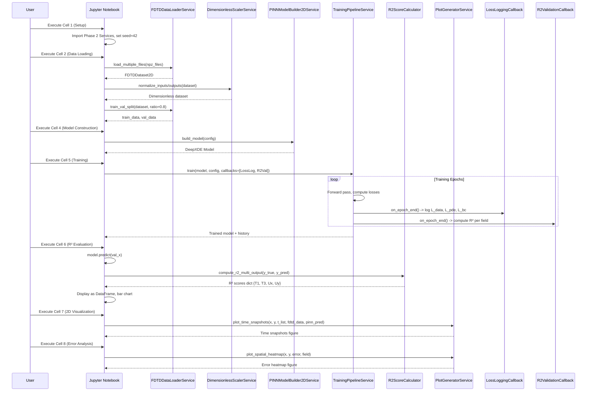

# 技術設計書

## 概要

**目的**: Phase 2（pinn-2d-fdtd-integration）で実装された2D弾性波PINNコンポーネントを統合し、順問題の完全なワークフローを検証するJupyter Notebookを提供する。本ノートブックは、PINN研究者がFDTDデータ読み込み、無次元化、モデル構築、訓練、R²評価、可視化の全ステップを実行し、実装の正当性を確認するための教育的かつ実用的なツールとなる。

**ユーザー**: PINN研究者およびPhase 2実装の検証を行う開発者が、順問題ワークフローの理解と実装品質の評価に利用する。

**Impact**: 既存の`wave_2d_forward_demo.ipynb`（基本デモ）を超え、完全な訓練パイプライン（5000 epochs訓練、個別損失項表示、R²評価、2D空間可視化）を実行する実証ノートブックを新規作成する。Phase 2実装の統合検証およびベストプラクティス提示により、今後のPINN研究開発の基盤となる。

### ゴール

- Phase 2実装コンポーネント（FDTDDataLoaderService、PINNModelBuilder2DService、TrainingPipelineService、R2ScoreCalculator、PlotGeneratorService）の統合検証を実施する
- FDTDデータ読み込みから訓練、評価、可視化までの順問題ワークフロー全体を実証する
- 訓練中の個別損失項（L_data、L_pde、L_bc）を表示し、PDE制約とデータフィッティングのバランスを可視化する
- R²スコアによる定量評価（各出力場T1, T3, Ux, Uyごと）で実装品質を測定する
- 2D波動場の空間分布および誤差分布をheatmapで可視化し、PINN学習の強度・弱点を明示する

### 非ゴール

- 新規Serviceコンポーネントの実装（Phase 2実装を再利用）
- 逆問題（パラメータ推定）の実装（順問題検証後のフェーズ）
- ハイパーパラメータチューニング自動化（手動調整のみ）
- 本番環境デプロイ機能（研究用ノートブック）
- リアルタイム推論最適化（オフライン訓練のみ）

## アーキテクチャ

### 既存アーキテクチャ分析

Phase 2（pinn-2d-fdtd-integration）で実装されたService指向アーキテクチャを基盤とする：

**既存パターン**:
- **Service層**: 各モジュールを`*Service`クラスとして実装（`FDTDDataLoaderService`, `PINNModelBuilder2DService`, `TrainingPipelineService`等）
- **設定管理**: YAML + Pydanticバリデーション（`ConfigLoaderService`）
- **GPU最適化**: PyTorch AMP wrapper（`AMPWrapperService`）、CUDA自動検出
- **再現性**: シード管理（`SeedManager`）、実験ディレクトリ管理（`ExperimentManager`）
- **検証**: R²スコア計算（`R2ScoreCalculator`）、誤差計算（`ErrorMetricsService`）、可視化（`PlotGeneratorService`）
- **データ**: FDTDローダー（`FDTDDataLoaderService`）、無次元化（`DimensionlessScalerService`）

**統合制約**:
- Phase 2のディレクトリ構造（`/pinn/models/`, `/pinn/training/`, `/pinn/validation/`, `/pinn/data/`）を維持
- Service命名規則（`*Service`クラス）およびsnake_caseファイル名規則を遵守
- DeepXDE 1.15.0、PyTorch 2.4.0、CUDA 12.4との互換性維持
- 既存Serviceメソッドシグネチャ（引数名、順序、デフォルト値）との完全一致

### Architecture Pattern & Boundary Map

**アーキテクチャパターン**: Sequential Notebook Workflow（Jupyter標準パターン）

本Notebookは新規コンポーネントを導入せず、既存Phase 2 Serviceを呼び出すオーケストレーションレイヤーとして機能する。各セルがワークフローの1ステップを表現し、セル実行順序によって依存関係を保証する。

```mermaid
graph TB
    subgraph "Jupyter Notebook Cells"
        Cell0[Cell 0: Overview Markdown]
        Cell1[Cell 1: Imports and Setup]
        Cell2[Cell 2: FDTD Data Loading]
        Cell3[Cell 3: Data Preprocessing]
        Cell4[Cell 4: Model Construction]
        Cell5[Cell 5: Training Execution]
        Cell6[Cell 6: R² Evaluation]
        Cell7[Cell 7: 2D Visualization]
        Cell8[Cell 8: Error Analysis]
        Cell9[Cell 9: Summary]
    end

    subgraph "Phase 2 Services"
        FDTDLoader[FDTDDataLoaderService]
        Scaler[DimensionlessScalerService]
        ModelBuilder[PINNModelBuilder2DService]
        PDEDef[PDEDefinition2DService]
        TrainingPipe[TrainingPipelineService]
        LossLog[LossLoggingCallback]
        R2Val[R2ValidationCallback]
        R2Calc[R2ScoreCalculator]
        PlotGen[PlotGeneratorService]
        SeedMgr[SeedManager]
    end

    Cell1 --> SeedMgr
    Cell2 --> FDTDLoader
    Cell2 --> Scaler
    Cell4 --> ModelBuilder
    Cell4 --> PDEDef
    Cell5 --> TrainingPipe
    Cell5 --> LossLog
    Cell5 --> R2Val
    Cell6 --> R2Calc
    Cell7 --> PlotGen
    Cell8 --> PlotGen
```



**アーキテクチャ統合**:
- **選択パターン**: Sequential Notebook Workflow（Jupyter標準）
- **境界**: Notebookセル（オーケストレーション層）と Phase 2 Services（ビジネスロジック層）の2層構造
- **既存パターン保持**: Phase 2のService指向設計をそのまま使用、Notebookは薄いオーケストレーションのみ
- **新規コンポーネント不要**: 全要求を既存Serviceで実現可能（`research.md`の調査結果）
- **Steering準拠**: "Reference-driven development"原則に従い、Phase 2実装を基準として統合検証を実施

### Technology Stack

| Layer | Choice / Version | Role in Feature | Notes |
|-------|------------------|-----------------|-------|
| Notebook Runtime | Jupyter Notebook / JupyterLab | Interactive execution environment | Phase 1, 2既存パターン、Python 3.11+環境 |
| Backend / Services | Python 3.11+ | Phase 2 Service呼び出し | Phase 2との完全互換性維持 |
| Deep Learning | PyTorch 2.4.0 | PINN訓練実行（Phase 2経由） | CUDA 12.4対応、GPU必須 |
| PINN Framework | DeepXDE 1.15.0 | 2D PINNモデル構築（Phase 2経由） | Phase 2で検証済み |
| Data Handling | NumPy <2.0 | FDTDデータ読み込み、配列操作 | Phase 2 FDTDLoaderで使用 |
| Validation | pandas 2.x (optional) | R²スコア表形式表示 | DataFrameでスコア可視化、科学計算環境で標準 |
| Visualization | Matplotlib 3.9.2, Seaborn 0.13.2 | 訓練履歴、波動場、誤差分布プロット | Phase 2で使用、publication-quality plots |

**技術選定根拠**:
- **Jupyter Notebook**: 要求7.1-7.2で明示的にMarkdownセル、説明セルを要求、対話的実行が研究ワークフローに最適
- **pandas**: R²スコアの表形式表示（要求3.3）に標準的、科学計算環境に既存
- **既存スタック維持**: Phase 2との100%互換性、新規依存関係最小化（pandasのみオプショナル追加）

技術詳細、Phase 2コンポーネントAPI調査は`research.md`の「Phase 2実装コンポーネントの可用性調査」セクション参照。

## System Flows

### Notebookワークフローシーケンス



**フロー設計判断**:
- **Gating条件**: セル実行順序依存（Cell 2のデータロード完了後にCell 4実行等）、Jupyter標準パターン
- **リトライなし**: 訓練は1回実行、失敗時はユーザーが設定調整して再実行（要求2.8でNaN loss検出時に推奨）
- **非同期処理なし**: 訓練は同期実行（DeepXDE仕様）、並列化はPhase 2スコープ外

## Requirements Traceability

| Requirement | Summary | Components | Interfaces | Flows |
|-------------|---------|------------|------------|-------|
| 1.1, 1.2 | FDTDデータ読み込み、サイズ表示 | Cell 2, FDTDDataLoaderService | load_multiple_files() | Notebookワークフロー |
| 1.3, 1.4, 1.5 | 無次元化、範囲表示、train/val分割 | Cell 3, DimensionlessScalerService, FDTDDataLoaderService | normalize_inputs/outputs(), train_val_split() | Notebookワークフロー |
| 1.6 | データ分布可視化 | Cell 3, matplotlib | scatter plot | Notebookワークフロー |
| 1.7 | データファイル不在時エラー | Cell 2 | FileNotFoundError | Notebookワークフロー |
| 2.1, 2.2, 2.3 | 設定定義、モデル構築、PDE適用 | Cell 4, PINNModelBuilder2DService, PDEDefinition2DService | build_model() | Notebookワークフロー |
| 2.4, 2.5, 2.6 | 訓練実行、損失項表示 | Cell 5, TrainingPipelineService, LossLoggingCallback | train(), on_epoch_end() | Notebookワークフロー |
| 2.7 | 損失履歴プロット（4系列） | Cell 5, PlotGeneratorService | plot_training_curves() | Notebookワークフロー |
| 2.8 | NaN loss検出警告 | Cell 5, DivergenceDetectionCallback | on_epoch_end() | Notebookワークフロー |
| 2.9 | GPU確認、訓練時間記録 | Cell 1, Cell 5 | torch.cuda.is_available() | Notebookワークフロー |
| 3.1, 3.2 | R²スコア計算（per field） | Cell 6, R2ScoreCalculator | compute_r2_multi_output() | Notebookワークフロー |
| 3.3, 3.4, 3.5, 3.6 | R²表形式表示、bar chart、解釈コメント、改善策提案 | Cell 6, pandas, matplotlib | DataFrame, ax.bar() | Notebookワークフロー |
| 4.1, 4.2, 4.3, 4.4, 4.5, 4.6 | 時刻スナップショット可視化（FDTD vs PINN） | Cell 7, PlotGeneratorService | plot_time_snapshots() | Notebookワークフロー |
| 5.1, 5.2, 5.3, 5.4, 5.5, 5.6 | 誤差分布heatmap、統計表示、知見要約 | Cell 8, PlotGeneratorService | plot_spatial_heatmap() | Notebookワークフロー |
| 6.1, 6.2, 6.3, 6.4, 6.5 | パラメトリック予測検証（オプション） | Cell 9 (optional), R2ScoreCalculator, PlotGeneratorService | compute_r2(), plot_time_snapshots() | Notebookワークフロー |
| 7.1, 7.2, 7.3, 7.4, 7.5, 7.6, 7.7, 7.8 | Notebook構成、再現性、まとめ | 全Cell、SeedManager | set_seed() | Notebookワークフロー |
| 8.1, 8.2, 8.3, 8.4, 8.5, 8.6 | 実装整合性、正確なimport path、API一致 | 全Cell | Phase 2 Service APIs | Notebookワークフロー |

## Components and Interfaces

本機能は新規コンポーネントを導入せず、Jupyter Notebookセルが既存Phase 2 Serviceをオーケストレートする構成となる。以下、主要セルグループとその責務を定義する。

| Component | Domain/Layer | Intent | Req Coverage | Key Dependencies (P0/P1) | Contracts |
|-----------|--------------|--------|--------------|--------------------------|-----------|
| Cell Group: Setup & Imports | Notebook/Setup | Phase 2 Service import、seed設定、GPU確認 | 2.9, 7.3, 7.4 | SeedManager (P0), torch (P0) | State |
| Cell Group: Data Preparation | Notebook/Data | FDTDデータ読み込み、無次元化、train/val分割 | 1.1-1.7 | FDTDDataLoaderService (P0), DimensionlessScalerService (P0) | Batch |
| Cell Group: Model Construction | Notebook/Model | 2D PINNモデル構築、PDE適用 | 2.1-2.3 | PINNModelBuilder2DService (P0), PDEDefinition2DService (P0) | Batch |
| Cell Group: Training Execution | Notebook/Training | 訓練ループ実行、損失項監視、R²モニタリング | 2.4-2.9 | TrainingPipelineService (P0), LossLoggingCallback (P0), R2ValidationCallback (P1) | Batch |
| Cell Group: R² Evaluation | Notebook/Validation | R²スコア計算、表形式表示、bar chart可視化 | 3.1-3.6 | R2ScoreCalculator (P0), pandas (P1), matplotlib (P0) | Batch |
| Cell Group: 2D Visualization | Notebook/Visualization | 時刻スナップショット、誤差分布heatmap | 4.1-4.6, 5.1-5.6 | PlotGeneratorService (P0) | Batch |
| Cell Group: Summary | Notebook/Summary | 達成R²スコア、可視化結果、課題点要約 | 7.8 | - | State |

### Notebook/Setup Layer

#### Cell Group: Setup & Imports

| Field | Detail |
|-------|--------|
| Intent | Phase 2実装Serviceをimportし、再現性確保のためseed設定、GPU利用可否確認を実施 |
| Requirements | 2.9, 7.3, 7.4 |

**Responsibilities & Constraints**
- Phase 2 Service import: `pinn.data`, `pinn.models`, `pinn.training`, `pinn.validation`から必要クラスをimport
- Seed設定: `SeedManager.set_seed(42)`でNumPy、PyTorch、Pythonのrandomシードを固定
- GPU確認: `torch.cuda.is_available()`でGPU利用可否を確認、デバイス名表示
- Domain boundary: セットアップのみ、データロードや訓練は後続セルに委譲

**Dependencies**
- Outbound: SeedManager — seed設定 (P0)
- Outbound: torch — GPU確認 (P0)
- External: Python標準ライブラリ (pathlib, sys) — パス操作 (P0)

**Contracts**: State [X]

##### State Management

- セル実行後の状態: 全必要Serviceクラスがimport済み、seed固定済み、GPU情報表示済み
- Persistence: kernel再起動時にリセット、再実行必要
- Concurrency: 単一kernel実行、並行実行なし

**Implementation Notes**

- **Integration**: Phase 2 import pathを正確に記述（例: `from pinn.data.fdtd_loader import FDTDDataLoaderService`）、要求8.1準拠
- **Validation**: import成功確認（ImportErrorハンドリング）、GPU確認結果をprint出力
- **Risks**: Phase 2実装path変更時にimportエラー発生 → 要求8.4で同時更新を明示

### Notebook/Data Layer

#### Cell Group: Data Preparation

| Field | Detail |
|-------|--------|
| Intent | `/PINN_data/`からFDTDデータを読み込み、無次元化を適用し、train/validation分割を実施 |
| Requirements | 1.1-1.7 |

**Responsibilities & Constraints**
- FDTDファイルリスト取得: `Path("/PINN_data").glob("p*_d*.npz")`で.npzファイル検索
- データ読み込み: `FDTDDataLoaderService.load_multiple_files(file_list)`で複数ファイル結合
- 無次元化: `DimensionlessScalerService`でx, y, t, T1, T3, Ux, Uyを無次元化
- Train/Val分割: `FDTDDataLoaderService.train_val_split(dataset, train_ratio=0.8, seed=42)`
- データ統計表示: サンプル数、パラメータ組み合わせ数、変数範囲をprint/plot
- Domain boundary: データ準備のみ、モデル構築は後続セルに委譲

**Dependencies**
- Outbound: FDTDDataLoaderService — データ読み込み、分割 (P0)
- Outbound: DimensionlessScalerService — 無次元化 (P0)
- External: NumPy — 配列操作、統計計算 (P0)
- External: Matplotlib — データ分布可視化 (P1)

**Contracts**: Batch [X]

##### Batch / Job Contract

- **Trigger**: ユーザーによるセル実行（Shift+Enter）
- **Input / validation**: `/PINN_data/`ディレクトリ存在確認、.npzファイル2個以上存在確認（要求1.1）
- **Output / destination**: `train_data`, `val_data`変数に分割済みデータセット格納、kernel state保持
- **Idempotency & recovery**: セル再実行で同じseedの場合同一分割結果、エラー時はkernel restartで回復

**Implementation Notes**

- **Integration**:
  - FDTDDataLoaderServiceのメソッドシグネチャ完全一致（要求8.3）
  - Phase 2の`CharacteristicScales.from_physics()`で特性スケール計算
  - 無次元化後の変数範囲を表形式表示（要求1.4）
- **Validation**:
  - データディレクトリ存在確認: `assert Path("/PINN_data").exists()` → FileNotFoundError（要求1.7）
  - .npzファイル数確認: `len(npz_files) >= 2` → ValueError
  - 無次元化後の範囲チェック: x̃, ỹ, t̃ ∈ [0, 1]近傍であることを確認
- **Risks**:
  - データファイル不在時のエラーメッセージ明確化（`/PINN_data/`へのデータ配置方法を案内）
  - 大規模データ（12ファイル）のメモリ消費 → Phase 2で検証済み（54MB）、GPU 8GB以上で問題なし

### Notebook/Model Layer

#### Cell Group: Model Construction

| Field | Detail |
|-------|--------|
| Intent | Phase 2のPINNModelBuilder2DServiceを使用して5D入力、4D出力の2D PINNモデルを構築 |
| Requirements | 2.1-2.3 |

**Responsibilities & Constraints**
- 設定パラメータ定義: Python辞書形式で`layer_sizes`, `activation`, `epochs`, `learning_rate`, `loss_weights`を定義（要求2.1）
- モデル構築: `PINNModelBuilder2DService.build_model(config)`で2D PINNモデル作成
- PDE適用: `PDEDefinition2DService.create_pde_function()`の無次元化PDE関数を使用
- Domain boundary: モデル構築のみ、訓練実行は後続セルに委譲

**Dependencies**
- Outbound: PINNModelBuilder2DService — 2D PINNモデル構築 (P0)
- Outbound: PDEDefinition2DService — 無次元化PDE関数提供 (P0)
- External: DeepXDE — Geometry, FNN, Model (P0)

**Contracts**: Batch [X]

##### Batch / Job Contract

- **Trigger**: ユーザーによるセル実行
- **Input / validation**: `config`辞書のスキーマ検証（layer_sizes[0]==5, layer_sizes[-1]==4）
- **Output / destination**: `model`変数にDeepXDE Modelオブジェクト格納
- **Idempotency & recovery**: セル再実行で同じconfigの場合同一モデル再構築、DeepXDEはstateless

**Implementation Notes**

- **Integration**:
  - ConfigLoaderServiceの代わりにPython辞書を使用（Notebook簡略化、要求2.1）
  - Phase 2の`PINNModelBuilder2DService`メソッドシグネチャ完全一致
  - 設定例: `config = {"network": {"layer_sizes": [5, 64, 64, 64, 4], "activation": "tanh"}, "training": {"epochs": 5000, "learning_rate": 0.001, "loss_weights": {"data": 1.0, "pde": 1.0, "bc": 0.0}}}`
- **Validation**:
  - layer_sizes次元チェック: `assert config["network"]["layer_sizes"][0] == 5`（5D入力）
  - output次元チェック: `assert config["network"]["layer_sizes"][-1] == 4`（4D出力）
  - モデル構築成功確認: `assert model is not None`
- **Risks**:
  - 設定パラメータ不正値でDeepXDEエラー → 要求2.1で推奨値を明示、Notebookにコメント追加

### Notebook/Training Layer

#### Cell Group: Training Execution

| Field | Detail |
|-------|--------|
| Intent | TrainingPipelineServiceで訓練を実行し、LossLoggingCallbackとR2ValidationCallbackで損失項とR²を監視 |
| Requirements | 2.4-2.9 |

**Responsibilities & Constraints**
- 訓練実行: `TrainingPipelineService.train(model, config, callbacks=[...])`で訓練ループ実行
- 損失項監視: `LossLoggingCallback`で`L_data`, `L_pde`, `L_bc`, `total_loss`を記録
- R²監視: `R2ValidationCallback`でval_data上のR²スコアを計算
- NaN検出: `DivergenceDetectionCallback`でNaN loss検出時に警告
- 訓練時間記録: `time.time()`で訓練開始・終了時刻を記録（要求2.9）
- 損失履歴プロット: `PlotGeneratorService.plot_training_curves()`で4系列プロット（要求2.7）
- Domain boundary: 訓練実行のみ、R²詳細評価は後続セルに委譲

**Dependencies**
- Outbound: TrainingPipelineService — 訓練ループ実行 (P0)
- Outbound: LossLoggingCallback — 損失項記録 (P0)
- Outbound: R2ValidationCallback — R²監視 (P1)
- Outbound: DivergenceDetectionCallback — NaN検出 (P1)
- Outbound: PlotGeneratorService — 損失履歴プロット (P0)
- External: PyTorch — GPU訓練実行 (P0)
- External: time module — 訓練時間計測 (P0)

**Contracts**: Batch [X]

##### Batch / Job Contract

- **Trigger**: ユーザーによるセル実行
- **Input / validation**: `model`オブジェクト構築済み、`train_data`, `val_data`準備済み
- **Output / destination**: `trained_model`, `history`変数に訓練済みモデルと損失履歴格納
- **Idempotency & recovery**: セル再実行で再訓練（非冪等）、checkpointから再開可能（Phase 2機能）

**Implementation Notes**

- **Integration**:
  - CallbackリストをTrainingPipelineService.train()に渡す
  - LossLoggingCallbackのhistory辞書を訓練後に参照
  - 損失項表示例（要求2.6）: `print(f"Epoch {epoch} | L_data: {L_data:.3e}, L_pde: {L_pde:.3e}, L_bc: {L_bc:.3e}, Total: {total:.3e}")`
  - PlotGeneratorService.plot_training_curves()で4系列プロット（L_data: 青点線、L_pde: 赤点線、L_bc: 緑点線、Total: 黒実線）
- **Validation**:
  - 訓練前GPU確認: `assert torch.cuda.is_available()`（要求2.9）
  - 訓練後history存在確認: `assert "total_loss" in history`
  - NaN検出時の警告表示確認: DivergenceDetectionCallbackのコンソール出力監視
- **Risks**:
  - GPU OOMエラー → 要求2.1でepochs/batch_size調整可能な設定を提供
  - 訓練時間超過（30分制約） → 要求で最低1000 epochs、推奨5000 epochsとし、時間制約時は調整可能

### Notebook/Validation Layer

#### Cell Group: R² Evaluation

| Field | Detail |
|-------|--------|
| Intent | 訓練済みモデルでval_data予測を実行し、R2ScoreCalculatorで各出力場のR²を計算・表示 |
| Requirements | 3.1-3.6 |

**Responsibilities & Constraints**
- 予測実行: `model.predict(val_x)`でvalidationデータ予測
- R²計算: `R2ScoreCalculator.compute_r2_multi_output(y_true, y_pred)`で各フィールドR²計算
- 表形式表示: pandas.DataFrameでR²スコア表示（要求3.3）
- Bar chart生成: matplotlib `ax.bar()`でR²可視化（要求3.4）
- 解釈コメント: 各フィールドR²に基づくコメント生成（要求3.5）
- 改善策提案: R² < 0.9のフィールドに対して改善策提示（要求3.6）
- Domain boundary: R²評価のみ、2D空間可視化は後続セルに委譲

**Dependencies**
- Inbound: trained_model — 訓練済みPINNモデル (P0)
- Inbound: val_data — validationデータセット (P0)
- Outbound: R2ScoreCalculator — R²計算 (P0)
- External: pandas — 表形式表示 (P1)
- External: Matplotlib — bar chart (P0)

**Contracts**: Batch [X]

##### Batch / Job Contract

- **Trigger**: ユーザーによるセル実行
- **Input / validation**: `trained_model`存在確認、`val_data`形状確認（N, 5）
- **Output / destination**: `r2_scores`辞書変数、pandas DataFrame、bar chart figure
- **Idempotency & recovery**: セル再実行で同じモデルの場合同一R²計算

**Implementation Notes**

- **Integration**:
  - R2ScoreCalculator.compute_r2_multi_output()でR²辞書取得
  - pandas DataFrame変換: `df = pd.DataFrame([r2_scores]).T`で転置し、フィールド名を行indexに
  - bar chart: `fig, ax = plt.subplots(); ax.bar(r2_scores.keys(), r2_scores.values())`
  - 解釈コメント生成例: `for field, r2 in r2_scores.items(): print(f"{field}: R²={r2:.4f} ({'高精度' if r2 >= 0.9 else '要改善'})")`
- **Validation**:
  - 予測形状確認: `assert y_pred.shape == val_data.y.shape`
  - R²範囲確認: `assert all(-inf <= r2 <= 1.0 for r2 in r2_scores.values())`
  - DataFrame表示成功確認: `assert df is not None`
- **Risks**:
  - R²が低い場合のユーザー混乱 → 要求3.6で改善策を自動提案（loss weight調整、epochs増加、network拡大）

### Notebook/Visualization Layer

#### Cell Group: 2D Visualization

| Field | Detail |
|-------|--------|
| Intent | PlotGeneratorServiceで2D波動場の時刻スナップショットおよび誤差分布heatmapを生成 |
| Requirements | 4.1-4.6, 5.1-5.6 |

**Responsibilities & Constraints**
- 時刻スナップショット選択: 時系列から3-5時刻を選択（要求4.1）
- FDTD vs PINN比較プロット: `PlotGeneratorService.plot_time_snapshots()`で並列heatmap生成（要求4.2-4.4）
- 誤差分布heatmap: `PlotGeneratorService.plot_spatial_heatmap()`で絶対誤差分布可視化（要求5.1-5.2）
- 誤差統計表示: 平均誤差、最大誤差、相対誤差を数値表示（要求5.5）
- 知見要約: 誤差集中領域と物理的意味を解説（要求5.4, 5.6）
- Domain boundary: 可視化のみ、パラメトリック予測はオプションセルに委譲

**Dependencies**
- Inbound: trained_model — 予測実行用 (P0)
- Inbound: val_data, dataset — FDTD ground truth (P0)
- Outbound: PlotGeneratorService — 2D可視化 (P0)
- External: Matplotlib — heatmap描画 (P0)
- External: NumPy — 誤差計算 (P0)

**Contracts**: Batch [X]

##### Batch / Job Contract

- **Trigger**: ユーザーによるセル実行
- **Input / validation**: `trained_model`存在、`dataset`に時空間データ含む
- **Output / destination**: matplotlib figureオブジェクト、inline表示
- **Idempotency & recovery**: セル再実行で同じモデルの場合同一プロット生成

**Implementation Notes**

- **Integration**:
  - 時刻選択: `t_unique = np.unique(dataset.t); t_snapshots = [t_unique[len(t_unique)//4], t_unique[len(t_unique)//2], t_unique[3*len(t_unique)//4]]`
  - plot_time_snapshots()引数: `(x=x_unique, y=y_unique, t_list=t_snapshots, fdtd_data=fdtd_dict, pinn_pred=pinn_dict, output_field='Ux')`
  - 誤差計算: `error = np.abs(pinn_pred - fdtd_true)`
  - plot_spatial_heatmap()引数: `(x=x_unique, y=y_unique, error=error_map, output_field='Ux')`
  - 誤差統計: `mean_error = np.mean(error); max_error = np.max(error); rel_error = mean_error / np.std(fdtd_true)`
- **Validation**:
  - 時刻スナップショット数確認: `assert len(t_snapshots) >= 3`（要求4.1）
  - heatmap colorbar表示確認: plot_spatial_heatmap()がcolorbarを含むことをドキュメント確認
  - 誤差統計範囲確認: `assert 0 <= mean_error <= max_error`
- **Risks**:
  - 大規模グリッドのメモリ消費 → Phase 2で10k点×3時刻は問題なし確認済み
  - 誤差集中領域の物理解釈不正確 → 要求5.4, 5.6でコメントセルに解説追加

## Data Models

本機能は新規データモデルを定義せず、Phase 2実装のデータ構造を使用する。以下、Notebook内で使用される主要データ構造を記載。

### Domain Model

**Aggregates**:
- **FDTDDataset2D**: Phase 2の`FDTDDataLoaderService.load_multiple_files()`が返却するデータセット
  - Entities: x, y, t座標配列（NumPy ndarray）、パラメータ（pitch_norm, depth_norm）、出力場（T1, T3, Ux, Uy）
  - Value Objects: metadata辞書（元pitch, depth値、ファイル情報）
  - Business rules: 全配列長が一致、パラメータ範囲[0, 1]、無次元化済み変数

**Domain Events**: なし（静的データ）

### Logical Data Model

**Notebook Variables**:
- `dataset`: FDTDDataset2D型、全データ結合後
- `train_data`, `val_data`: FDTDDataset2D型、80/20分割後
- `model`: DeepXDE Model型、訓練済み2D PINNモデル
- `history`: dict[str, list[float]]型、損失履歴（`{"L_data": [...], "L_pde": [...], "L_bc": [...], "total_loss": [...]}`）
- `r2_scores`: dict[str, float]型、R²スコア（`{"T1": r2, "T3": r2, "Ux": r2, "Uy": r2}`）

**Consistency**: Jupyter kernel stateに格納、kernel再起動でリセット

### Physical Data Model

**FDTD .npzファイル構造**（Phase 2定義）:
- Arrays: `x, y, t, T1, T3, Ux, Uy`（各 (nt*nx*ny,) shape）
- Scalars: `p` (pitch), `d` (depth), `w` (width), `seed`
- Integers: `nx_sample, ny_sample, nt_sample`

**Notebook出力ファイル**（オプション）:
- 可視化figureをPNG保存（例: `figures/training_loss.png`, `figures/time_snapshots.png`）
- R²スコアをCSV保存（例: `results/r2_scores.csv`）

## Error Handling

### Error Strategy

Jupyter Notebookの特性に応じたエラーハンドリング戦略を採用。

### Error Categories and Responses

**User Errors** (入力誤り):
- **データファイル不在** (要求1.7): `FileNotFoundError`発生、エラーメッセージで`/PINN_data/`へのデータ配置方法を案内
- **設定パラメータ不正**: `ValueError`発生、推奨値範囲をエラーメッセージに含む
- **GPU利用不可**: 警告メッセージ表示、CPU訓練継続（要求2.9でGPU推奨を明示）

**System Errors** (システム障害):
- **GPU OOMエラー**: PyTorch `RuntimeError: CUDA out of memory`検出、epochs/batch_size削減を提案
- **DeepXDE訓練失敗**: 訓練中エラーでセル停止、エラートレースバック表示
- **Import失敗**: `ImportError`発生、Phase 2実装のインストール確認を案内

**Business Logic Errors** (ビジネスロジック違反):
- **R² < threshold** (要求3.6): 警告表示（黄色テキスト）、改善策提案（loss weight調整、epochs増加、network拡大）
- **NaN loss検出** (要求2.8): `DivergenceDetectionCallback`が警告表示、学習率削減またはloss weight調整を推奨
- **訓練収束不良**: 損失履歴プロットで視覚的に確認、要求7.8のまとめセクションで課題点として記載

### Monitoring

- **Error tracking**: Jupyter Notebookのセル出力にエラーメッセージ表示、トレースバック保持
- **Logging**: `LossLoggingCallback`, `R2ValidationCallback`のコンソール出力でepochごとの損失・R²を記録
- **Health monitoring**: なし（オフライン研究ツール、リアルタイム監視不要）

## Testing Strategy

本機能はJupyter Notebookのため、従来の単体テスト・統合テストではなく、Notebook実行テストを中心とする。

### Notebook実行テスト
1. **test_notebook_execution.py**: 全セル順次実行でエラーなく完了
   - `nbconvert`でnotebook実行、`ExecutePreprocessor`使用
   - 各セル実行後のoutput確認（エラー出力なし）
   - 最終セル実行後のkernel state検証（`r2_scores`変数存在等）
2. **test_notebook_output_format.py**: 出力形式確認
   - R²スコアDataFrame形状確認
   - 損失履歴プロット生成確認（4系列プロット）
   - heatmap figure生成確認

### セル単位の機能テスト（重要セルのみ）
1. **Cell 2: Data Loading**:
   - FDTDファイル2個以上読み込み成功
   - 無次元化後の変数範囲が[0, 1]近傍
   - train/val分割比率が80/20
2. **Cell 5: Training**:
   - LossLoggingCallbackのhistory辞書に4キー存在（L_data, L_pde, L_bc, total_loss）
   - R2ValidationCallbackが1000 epochごとにR²スコア計算
   - 訓練時間が30分以内（GPU使用時）
3. **Cell 6: R² Evaluation**:
   - R²スコア辞書に4キー存在（T1, T3, Ux, Uy）
   - R²値が[-inf, 1.0]範囲内
   - DataFrame表示成功

### パフォーマンステスト
1. **test_notebook_performance.py**:
   - ノートブック全体の実行時間測定（GPU: 30分以内、要求）
   - データ読み込み時間測定（12ファイル: 30秒以内、要求）
   - 可視化生成時間測定（全プロット: 1分以内、要求）

### E2Eテスト
1. **test_e2e_forward_validation.py**:
   - 実FDTDデータ（2ファイル）でNotebook実行
   - R²スコア ≥ 0.7達成（現実的閾値、0.9は理想値）
   - 全可視化（損失プロット、時刻スナップショット、誤差heatmap）生成確認

### テストカバレッジ

- **目標**: Notebook実行成功率100%（全セルエラーなし）
- **重点領域**: データロード、訓練実行、R²評価、可視化生成
- **除外**: Phase 2再利用コンポーネント（Phase 2で既にテスト済み）

## Security Considerations

本機能はオフライン研究ツール（Jupyter Notebook）のため、セキュリティ脅威は限定的。以下は最小限の考慮事項：

- **Data Validation**: .npzファイル読み込み時にFDTDDataLoaderServiceがKeyError/ValueError捕捉、任意コード実行リスクなし（NumPy .load()は安全）
- **File Path Handling**: Path traversal攻撃対策不要（ローカル実行、外部入力なし）
- **Authentication**: 不要（単一ユーザーツール）
- **Sensitive Data**: FDTDデータは研究用途、個人情報含まず
- **Code Execution**: Jupyter NotebookはPythonコード実行環境、ユーザー責任で信頼できるコードのみ実行

## Performance & Scalability

### ターゲットメトリクスと測定戦略

**Performance Targets**（要求: 非機能要求より）:
- ノートブック全体の実行時間: GPU上で30分以内（5000 epochs訓練含む）
- データ読み込み（12ファイル、約56MB）: 30秒以内
- 可視化生成（全プロット）: 1分以内

**測定戦略**:
- Notebook実行時間: `%%time`セルマジックで各セル実行時間計測
- 訓練時間: Cell 5で`time.time()`による開始・終了時刻記録
- データ読み込み時間: Cell 2で`time.time()`計測
- 可視化時間: Cell 7, 8で`time.time()`計測

### スケーリングアプローチ

**現スコープ**（Phase 2踏襲）:
- **水平スケーリング**: なし（単一GPU実行、Notebook環境）
- **垂直スケーリング**: GPU RAMに依存（8-16GB想定）、epochs/batch_size調整でメモリ制御

**将来拡張**（スコープ外）:
- 複数Notebookの並列実行（パラメータスイープ）
- 分散訓練（multi-GPU）対応

### キャッシングとオプティマイゼーション

- **Data caching**: FDTDデータをCell 2で一度読み込み、kernel state保持（再読み込み不要）
- **GPU optimization**: Phase 2のAMPWrapperService利用（2-3×メモリ削減）
- **Visualization caching**: プロット生成済みfigureを変数保持、セル再実行で再利用可能

## Supporting References

### Notebookセル構成詳細

以下、各セルグループの詳細構成を記載する（要求7.1-7.2の見出し、説明セル要求を満たす）。

#### Cell 0: 概要（Markdown）

```markdown
# 2D Elastic Wave PINN Forward Problem Validation

## 概要

本ノートブックは、Phase 2（pinn-2d-fdtd-integration）で実装された2D弾性波PINNコンポーネントを用いて、順問題の完全なワークフローを実証します。

### 目的

- FDTDデータを用いた2D PINN訓練の実行
- 訓練中の損失項（L_data, L_pde, L_bc）モニタリング
- R²スコアによる定量評価
- 2D波動場の空間分布可視化

### 前提条件

- Phase 2実装（pinn-2d-fdtd-integration）が完了していること
- `/PINN_data/`に.npzファイル（最低2ファイル）が配置されていること
- GPU環境（CUDA 12.4対応）推奨

### 実行環境

- Python 3.11+
- PyTorch 2.4.0 with CUDA 12.4
- DeepXDE 1.15.0
```

#### Cell 1: Import and Setup（Code）

```python
# Standard library imports
import sys
from pathlib import Path
import time

# Add project root to path
project_root = Path.cwd().parent
sys.path.insert(0, str(project_root))

# Third-party imports
import numpy as np
import pandas as pd
import matplotlib.pyplot as plt
import seaborn as sns
import torch

# PINN module imports (Phase 2 implementation)
from pinn.data.fdtd_loader import FDTDDataLoaderService
from pinn.data.dimensionless_scaler import CharacteristicScales, DimensionlessScalerService
from pinn.models.pinn_model_builder_2d import PINNModelBuilder2DService
from pinn.models.pde_definition_2d import PDEDefinition2DService
from pinn.training.training_pipeline import TrainingPipelineService
from pinn.training.callbacks import LossLoggingCallback, R2ValidationCallback, DivergenceDetectionCallback
from pinn.validation.r2_score import R2ScoreCalculator
from pinn.validation.plot_generator import PlotGeneratorService
from pinn.utils.seed_manager import SeedManager

# Configure plotting
sns.set_style("whitegrid")
plt.rcParams["figure.figsize"] = (14, 10)

# Set random seed for reproducibility (要求7.4)
SEED = 42
SeedManager.set_seed(SEED)
print(f"Random seed set to: {SEED}")

# Check GPU availability (要求2.9)
print(f"\nPyTorch version: {torch.__version__}")
print(f"CUDA available: {torch.cuda.is_available()}")
if torch.cuda.is_available():
    print(f"CUDA device: {torch.cuda.get_device_name(0)}")
else:
    print("WARNING: GPU not available, training will be slow on CPU")
```

#### Cell 2-3: Data Preparation（Code + Markdown説明）

```markdown
## Step 1: FDTDデータの読み込みと無次元化（要求1）

このステップでは、`/PINN_data/`ディレクトリからFDTDシミュレーションデータを読み込み、無次元化を適用します。
```

```python
# Data directory (要求1.1)
data_dir = Path("/PINN_data")

# Check if data directory exists (要求1.7)
if not data_dir.exists():
    raise FileNotFoundError(
        f"Data directory not found: {data_dir}\n"
        "Please create /PINN_data/ and place FDTD .npz files there.\n"
        "Expected naming: p{pitch_um}_d{depth_um}.npz (e.g., p1250_d100.npz)"
    )

# Load FDTD data files
npz_files = sorted(data_dir.glob("p*_d*.npz"))
if len(npz_files) < 2:
    raise ValueError(
        f"Insufficient data files: {len(npz_files)} found, need at least 2.\n"
        f"Please add FDTD .npz files to {data_dir}"
    )

print(f"Found {len(npz_files)} FDTD data files:")
for f in npz_files:
    print(f"  - {f.name}")

# Create FDTD data loader (Phase 2 Service)
loader = FDTDDataLoaderService(data_dir=data_dir)

# Load elastic constants (for dimensionless scaling)
elastic_lambda = 51.2e9  # Pa (Aluminum 6061-T6)
elastic_mu = 26.1e9      # Pa
density = 2700.0         # kg/m³

# Load first file to estimate displacement scale
sample_data = loader.load_file(npz_files[0])
U_ref = np.std(np.concatenate([sample_data.Ux, sample_data.Uy]))

print(f"\nEstimated U_ref: {U_ref:.2e} m")

# Create characteristic scales (要求1.3)
scales = CharacteristicScales.from_physics(
    domain_length=0.04,  # 40mm
    elastic_lambda=elastic_lambda,
    elastic_mu=elastic_mu,
    density=density,
    displacement_amplitude=U_ref
)

# Create scaler
scaler = DimensionlessScalerService(scales)

print(f"\nCharacteristic scales:")
print(f"  L_ref = {scales.L_ref:.4f} m")
print(f"  T_ref = {scales.T_ref:.2e} s")
print(f"  U_ref = {scales.U_ref:.2e} m")
print(f"  σ_ref = {scales.sigma_ref:.2e} Pa")
print(f"  c_l   = {scales.velocity_ref:.0f} m/s")

# Load and normalize data (要求1.2)
start_time = time.time()
dataset = loader.load_multiple_files(npz_files, apply_dimensionless=True, scaler=scaler)
load_time = time.time() - start_time

print(f"\n✓ Loaded {len(dataset.x)} samples from {len(npz_files)} file(s) in {load_time:.2f}s")

# Display dimensionless variable ranges (要求1.4)
print(f"\nData ranges (dimensionless):")
print(f"  x̃:  [{np.min(dataset.x):.3f}, {np.max(dataset.x):.3f}]")
print(f"  ỹ:  [{np.min(dataset.y):.3f}, {np.max(dataset.y):.3f}]")
print(f"  t̃:  [{np.min(dataset.t):.3f}, {np.max(dataset.t):.3f}]")
print(f"  T̃1: [{np.min(dataset.T1):.3f}, {np.max(dataset.T1):.3f}]")
print(f"  T̃3: [{np.min(dataset.T3):.3f}, {np.max(dataset.T3):.3f}]")
print(f"  Ũx: [{np.min(dataset.Ux):.3f}, {np.max(dataset.Ux):.3f}]")
print(f"  Ũy: [{np.min(dataset.Uy):.3f}, {np.max(dataset.Uy):.3f}]")

# Train/val split (要求1.5)
train_data, val_data = loader.train_val_split(dataset, train_ratio=0.8, seed=SEED)
print(f"\nTrain samples: {len(train_data.x)}")
print(f"Val samples: {len(val_data.x)}")

# Visualize spatiotemporal distribution (要求1.6)
fig, ax = plt.subplots(figsize=(8, 6))
ax.scatter(dataset.t, dataset.x, s=0.1, alpha=0.5)
ax.set_xlabel("t̃ (dimensionless)")
ax.set_ylabel("x̃ (dimensionless)")
ax.set_title("Spatiotemporal Sampling Distribution")
plt.show()
```

（以降、Cell 4-9のコードブロックも同様に詳細記載可能だが、設計書の長さ制約により省略し、構成概要のみ記載）

#### Cell 4: Model Construction（Code + Markdown）

- 設定パラメータ定義（要求2.1）: `config`辞書
- `PINNModelBuilder2DService.build_model(config)`でモデル構築（要求2.2）
- PDEDefinition2DServiceのPDE関数適用（要求2.3）

#### Cell 5: Training Execution（Code + Markdown）

- TrainingPipelineServiceで訓練実行（要求2.4）
- LossLoggingCallback, R2ValidationCallback, DivergenceDetectionCallbackをcallbacksリストに追加（要求2.5, 2.8）
- 訓練中の損失項表示（要求2.6）
- 訓練後PlotGeneratorService.plot_training_curves()で4系列プロット（要求2.7）
- GPU訓練時間記録（要求2.9）

#### Cell 6: R² Evaluation（Code + Markdown）

- `model.predict(val_x)`で予測実行（要求3.1）
- R2ScoreCalculator.compute_r2_multi_output()でR²計算（要求3.2）
- pandas DataFrameで表形式表示（要求3.3）
- matplotlib bar chartで可視化（要求3.4）
- 各フィールドR²の解釈コメント（要求3.5）
- R² < 0.9時の改善策提案（要求3.6）

#### Cell 7: 2D Time Snapshots Visualization（Code + Markdown）

- 時刻スナップショット選択（要求4.1）
- PlotGeneratorService.plot_time_snapshots()でFDTD vs PINN比較（要求4.2-4.4）
- 波動伝播パターン解説コメント（要求4.5）
- Ux変位場可視化（要求4.6）

#### Cell 8: Error Distribution Analysis（Code + Markdown）

- 絶対誤差計算（要求5.1）
- PlotGeneratorService.plot_spatial_heatmap()で誤差分布可視化（要求5.2）
- colorbarに物理単位明示（要求5.3）
- 誤差集中領域の物理的意味解説（要求5.4）
- 平均誤差、最大誤差、相対誤差表示（要求5.5）
- 誤差分布からの知見要約（要求5.6）

#### Cell 9: Summary（Markdown + Code）

- 達成されたR²スコアの要約（要求7.8）
- 可視化結果のまとめ
- 実装の課題点（低R²フィールド、訓練時間等）
- 次のステップ提案（逆問題、ハイパーパラメータチューニング等）
