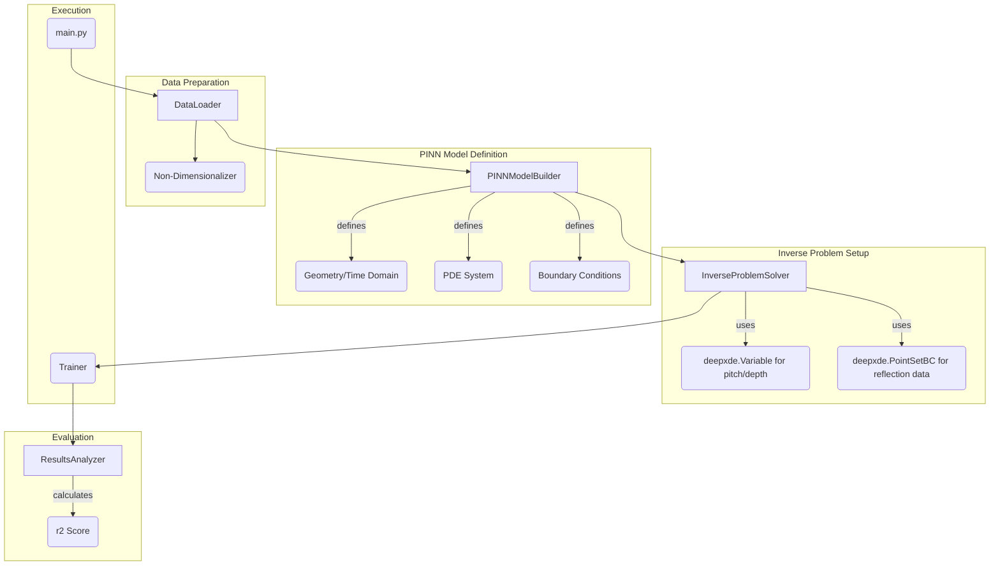

# Design Document: PINN Rough Surface Estimator

---
**Purpose**: To provide a detailed technical design for the implementation of a Physics-Informed Neural Network (PINN) capable of estimating rough surface parameters (`pitch`, `depth`) from simulated ultrasonic data.

**Approach**: This document outlines a modular, component-based Python application that uses the `deepxde` library. The design prioritizes clarity, testability, and adherence to physics-informed machine learning best practices, including non-dimensionalization.
---

## Overview
This feature will deliver a system to solve an inverse problem: inferring the geometric parameters of a rough surface by matching the output of a physics-informed model to observed reflection data.

- **Users**: Researchers in non-destructive testing.
- **Impact**: Automates the process of surface characterization, providing a quantitative and reproducible method for analysis.

### Goals
- Implement a PINN that solves the 2D elastic wave equation.
- Create an inverse model to estimate `pitch` and `depth` based on FDTD-generated data.
- Ensure the implementation is modular and reusable.
- Use non-dimensionalization to ensure training stability.

### Non-Goals
- Real-time estimation.
- Direct application to experimental data (this design focuses on using FDTD data for both training and "observation").
- A graphical user interface.

## Architecture

The system will be a Python-based pipeline orchestrated by a main script. The architecture is designed to be modular, separating data handling, model definition, and training logic into distinct components.

### Architecture Pattern & Boundary Map

The chosen pattern is a **Component-based Pipeline**.



**Architecture Integration**:
- **Selected pattern**: A modular pipeline where each component has a single responsibility.
- **Domain/feature boundaries**: 
  - Data loading and preprocessing are separate from model definition.
  - The core PINN forward model is defined independently of the inverse problem setup.
  - Training and evaluation are the final stages.
- **Steering compliance**: Although no steering context was provided, this modular design is a standard best practice that promotes maintainability and testability.

### Technology Stack

| Layer | Choice / Version | Role in Feature | Notes |
|-------|------------------|-----------------|-------|
| Backend / Services | Python 3.10+ | Core application language | |
| Backend / Services | DeepXDE | PINN framework for solving forward and inverse problems | Latest version recommended |
| Data / Storage | NumPy | For handling numerical data and `.npz` files | |
| Infrastructure / Runtime | CPU / GPU (optional) | Training environment | `deepxde` supports major backends (TensorFlow, PyTorch) |

## System Flows
The primary flow is linear:
1.  **Initialization**: The `main.py` script instantiates all components.
2.  **Data Loading**: The `DataLoader` loads a specific `.npz` file from the `PINN_data` directory.
3.  **Non-Dimensionalization**: The data and physical parameters are converted to a dimensionless form.
4.  **Model Building**: The `PINNModelBuilder` uses the non-dimensionalized parameters to define the `deepxde` problem (geometry, PDE, BCs).
5.  **Inverse Setup**: The `InverseProblemSolver` adds the unknown `pitch` and `depth` variables and the reflection data loss term.
6.  **Training**: The `Trainer` compiles and runs the `deepxde` training loop.
7.  **Evaluation**: The `ResultsAnalyzer` takes the trained model, inspects the final values of the `pitch` and `depth` variables, and calculates the r2 score against the ground truth.

## Requirements Traceability

| Requirement | Summary | Components |
|-------------|---------|------------|
| 1.1 - 1.6 | Parameter estimation using PINN model | `PINNModelBuilder`, `InverseProblemSolver` |
| 2.1 - 2.5 | Physics-informed constraints | `PINNModelBuilder` |
| 3.1 | Use DeepXDE | All components interacting with `deepxde` |
| 3.2 | Adhere to parameter ranges | `DataLoader` (for selecting data), `InverseProblemSolver` (for setting variable bounds if possible) |

## Components and Interfaces

### `data`

#### `DataLoader`
| Field | Detail |
|-------|--------|
| Intent | Loads data from `.npz` files and provides it in a format usable by the PINN. |
| Requirements | 3.2 |
**Responsibilities & Constraints**
- Reads a specified `.npz` file from the `PINN_data` directory.
- Extracts training data (collocation points, boundary points) and observation data (reflection waveform).
- Holds physical constants needed for non-dimensionalization.
**Contracts**: Service
```python
class DataLoader:
    def __init__(self, file_path: str): ...
    def get_data(self): -> Tuple[Dict, Dict]: 
        """Returns training data and observation data"""
        ...
    def get_physical_constants(self) -> Dict: ...
```

#### `NonDimensionalizer`
| Field | Detail |
|-------|--------|
| Intent | Converts physical data and parameters into a dimensionless system. |
| Requirements | 2.2 |
**Responsibilities & Constraints**
- Takes physical constants and data from `DataLoader`.
- Applies non-dimensionalization based on characteristic scales.
- Returns dimensionless data, parameters, and scales.
**Contracts**: Service
```python
class NonDimensionalizer:
    def __init__(self, physical_constants: Dict): ...
    def transform_data(self, data: Dict) -> Dict: ...
    def get_scales(self) -> Dict:
        """Returns the characteristic scales used."""
        ...
```

### `pinn`

#### `PINNModelBuilder`
| Field | Detail |
|-------|--------|
| Intent | Constructs the `deepxde` forward model (geometry, PDE, BCs). |
| Requirements | 1.1-1.3, 2.1-2.5 |
**Responsibilities & Constraints**
- Defines the `dde.geometry.GeometryXTime`.
- Implements the custom PDE function for the 2D elastic wave equation system.
- Implements the boundary condition functions, including the complex rough surface boundary.
**Contracts**: Service
```python
class PINNModelBuilder:
    def __init__(self, dimensionless_params: Dict): ...
    def define_pde_system(self, x, y) -> List: ...
    def define_boundary_conditions(self) -> List: ...
    def get_geometry(self) -> dde.geometry.GeometryXTime: ...
```

#### `InverseProblemSolver`
| Field | Detail |
|-------|--------|
| Intent | Configures the `deepxde` inverse problem. |
| Requirements | 1.4, 1.5 |
**Responsibilities & Constraints**
- Defines `pitch` and `depth` as `dde.Variable`.
- Defines the `dde.PointSetBC` using the reflection data.
- Assembles the final `dde.data.TimePDE` object.
**Contracts**: Service
```python
class InverseProblemSolver:
    def __init__(self, model_builder: PINNModelBuilder, observation_data: Dict): ...
    def get_inverse_variables(self) -> List[dde.Variable]: ...
    def create_data_object(self) -> dde.data.TimePDE: ...
```

### `training`

#### `Trainer`
| Field | Detail |
|-------|--------|
| Intent | Compiles and runs the training process. |
| Requirements | N/A |
**Responsibilities & Constraints**
- Defines the `dde.nn.FNN` network.
- Creates the `dde.Model`.
- Compiles the model with the Adam optimizer and `external_trainable_variables`.
- Runs the training loop, possibly in stages (e.g., Adam then L-BFGS).
**Contracts**: Service
```python
class Trainer:
    def __init__(self, data_obj: dde.data.TimePDE, inverse_vars: List[dde.Variable]): ...
    def train(self, epochs: int) -> dde.Model: ...
```

## Data Models

### Logical Data Model
- **Input**: `.npz` files containing:
    - `p`, `d`: Ground truth pitch and depth (scalars).
    - `x`, `y`, `t`: Sampled coordinates (arrays).
    - `T1`, `T3`, `Ux`, `Uy`: Sampled wavefield data at coordinates (arrays).
    - `reflection`: Time-series data of reflected wave at the probe (array).
- **In-Memory**: Data is structured into dictionaries for easy passing between components.
- **Output**: The trained `dde.Model` and the final values of the `pitch` and `depth` `dde.Variable`s.

## Testing Strategy
- **Unit Tests**:
    - `DataLoader`: Test loading of a sample `.npz` file and correct data extraction.
    - `NonDimensionalizer`: Verify transformation correctness with known inputs.
    - `PINNModelBuilder`: Test that the PDE function returns correct residuals for known analytical inputs (if simple cases can be constructed).
- **Integration Tests**:
    - Test the full pipeline on a single data file with a small number of epochs to ensure all components interact correctly.
- **E2E Tests**:
    - Run the full training for one case and verify that the estimated parameters are within a reasonable tolerance of the ground truth.
